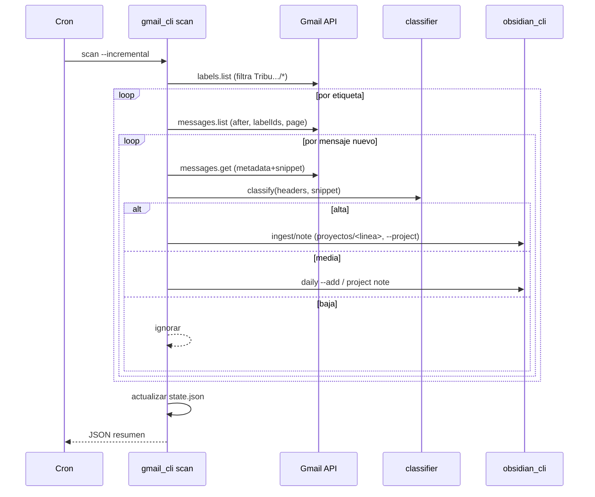

# Diseño — gmail-manager

## Arquitectura en capas

```
scripts/
  auth.py         # OAuth readonly (patrón de google-drive-manager): load_settings, get_credentials
  gmail_client.py # capa sobre Gmail API v3: list_labels, search_messages, get_message_meta/snippet
  classifier.py   # reglas de criticidad (alta/media/baja) + detección de compromiso + redacción PII
  state.py        # lee/escribe ~/.config/gmail-skill/state.json (última ejecución por etiqueta)
  gmail_cli.py    # CLI: auth, labels, scan (barrido/incremental), con --dry-run y salida JSON
```

El skill **no** reimplementa la escritura al vault: invoca el CLI de `obsidian-manager`
(`ingest`/`note`) como subproceso, para heredar frontmatter, tags canónicos y wikilinks. Esto
mantiene desacoplado el núcleo (igual que `sources` en obsidian-manager).

## Autenticación (Req 1)

Reutiliza el patrón de `google-drive-manager/scripts/auth.py`:
- `GMAIL_CREDENTIALS_PATH` (default `~/.config/gmail-skill/credentials.json`; puede apuntarse al
  mismo client web ya usado para Drive con redirect `http://localhost:8080/callback`).
- `GMAIL_TOKEN_PATH` (default `~/.config/gmail-skill/token.json`) — separado del token de Drive.
- Scope fijo `gmail.readonly`. Flujo con `Flow` + `redirect_uri` fijo `localhost:8080/callback`
  (el client OAuth disponible es tipo *web* con ese redirect autorizado; se documenta que un client
  *Desktop* también sirve con `run_local_server(port=0)`).

## Cliente Gmail (Req 2, 3, 5)

- `list_labels()` → nombres + ids; filtra hijas de `Tribu Servicios Bolivar/`.
- `search_messages(label_id, after_epoch, page_token)` → usa `users.messages.list` con
  `q="after:<epoch>"` + `labelIds=[label_id]`, paginado (`maxResults` acotado, p.ej. 100).
- `get_message(id, format="metadata")` → headers (From, Subject, Date) + `snippet` (Gmail ya provee
  un extracto corto); se evita `format=full` salvo que la clasificación lo requiera, para no traer
  cuerpos completos ni adjuntos.
- Enlace al hilo: `https://mail.google.com/mail/u/0/#all/<threadId>`.

## Clasificación por criticidad (Req 4)

`classifier.classify(headers, snippet, user_email) -> {nivel, motivos, compromiso}`:
- **Baja** (ignorar): remitente/asunto que casen listas de ruido (no-reply, notifications, Jira/
  Datadog automáticos, newsletters, `CATEGORY_PROMOTIONS/SOCIAL`).
- **Alta**: coincidencias de palabras/patrones de decisión/arquitectura/incidente/infra/acceso/
  acuerdo/fecha límite; **o** detección de compromiso dirigido al usuario (su nombre/email en To o
  en el texto junto a verbos de acción: "quedas encargado", "por favor", "necesito que", "puedes",
  "te asigno", "pendiente tuyo", fechas). El compromiso detectado se extrae como frase.
- **Media**: el resto que sí es de la línea de negocio pero no dispara "alta".
- **Redacción PII/secretos**: antes de escribir, `redact()` enmascara patrones de secreto
  (api-key, password, token, llaves, tarjetas) y no incluye el cuerpo completo, solo el snippet
  saneado + resumen.

Las reglas viven en tablas/listas configurables (no hardcode disperso), fáciles de afinar.

## Estado incremental (Req 3)

`state.json`:
```json
{ "labels": { "Tribu Servicios Bolivar/Libertador": { "last_run_epoch": 1790000000, "seen": ["<id>", ...] } } }
```
- Primer barrido: `after = now - 365d`.
- Incremental: `after = last_run_epoch - solape(10 min)`; se saltan ids en `seen` (se poda `seen`
  a una ventana razonable para no crecer sin límite).
- `last_run_epoch` se actualiza solo si la corrida terminó sin error para esa etiqueta.

## Indexación al vault (Req 4)

Por cada correo **alta**: crear nota en `proyectos/<línea>/` vía
`obsidian_cli.py ingest -` (stdin) o `note create`, con `--project <línea>` (que ya agrega el tag
canónico) + `--tag correo`. Nombre de nota: `correo-<fecha>-<slug-asunto>`.
Por cada correo **media**: `obsidian_cli.py daily --add` o `project note` (entrada breve en el
contexto del proyecto). **Baja**: no se escribe.

## CLI (Req 5)

- `auth` — autentica/renueva.
- `labels` — lista etiquetas (para verificación).
- `scan [--label ...] [--since-months 12] [--incremental] [--dry-run] [--max N]` — barrido.
  Salida JSON: `{ por_label: { leidos, alta, media, ignorados }, total, dry_run }`.
- Flags globales: `--pretty`, `--dry-run`, `--yes`, `--log-level`.

## Operación periódica (Req 5)

Artefacto de ejemplo (launchd `.plist` o línea cron) que ejecuta `gmail_cli.py scan --incremental`
cada 6 h. Documentado en README. Sin daemon: es el scheduler del SO quien lo dispara.

## Errores y resiliencia

- Reintentos con backoff en 429/500/503 (como google-drive-manager).
- Si una etiqueta falla, se reporta y se sigue; el estado de esa etiqueta no avanza.
- Timeouts y `maxResults` acotados; procesamiento en streaming por páginas.

## Diagrama de secuencia (barrido)



## Decisiones de diseño

- **Metadata+snippet en vez de cuerpo completo:** menos memoria, menos PII, suficiente para
  clasificar y resumir. Solo se pediría `full` si una regla lo exige (no en el MVP).
- **Escritura vía obsidian-manager:** un solo dueño de la lógica del vault; hereda la mejora de tag
  canónico por `--project`.
- **Estado por etiqueta:** permite reintentar una línea sin reprocesar las demás.
- **Sin proceso residente:** cumple el requisito de bajo consumo; el costo solo existe durante la corrida.
