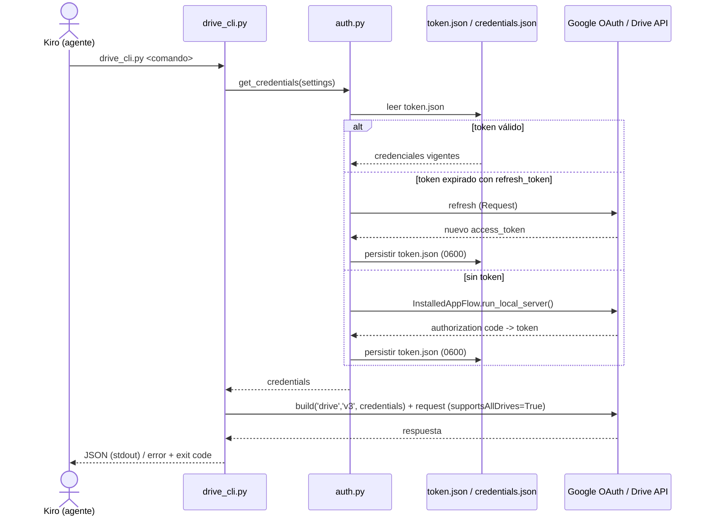

# Design — Skill `google-drive-manager`

## 1. Visión general

Skill autocontenido bajo `skills/workspace/google-drive-manager/` que expone un CLI Python
(`drive_cli.py`) con subcomandos para operar Google Drive en Mi unidad y Shared Drives. El
`SKILL.md` instruye al agente sobre qué subcomando ejecutar y cómo parsear la salida JSON.

Principios de diseño:
- **Separación de capas**: CLI (parseo/UX) → cliente (lógica de negocio + API) → auth (credenciales).
- **Salida JSON** determinista para consumo por el agente; `--pretty` para humanos.
- **Seguridad primero**: scopes mínimos, confirmaciones, `--dry-run`, sin borrado permanente, sin secretos en logs.
- **Paridad de unidades**: `supportsAllDrives=True` en todo; `includeItemsFromAllDrives=True` en listados.

## 2. Componentes

```
scripts/
├── drive_cli.py      # Capa CLI: argparse, subcomandos, --pretty/--dry-run/--yes,
│                     #   códigos de salida, serialización JSON. Sin lógica de API.
├── auth.py           # Credenciales/token: carga credentials.json, flujo OAuth loopback,
│                     #   persistencia y refresh de token.json, resolución de scopes/paths.
├── drive_client.py   # Wrapper de la Drive API: build(service), paginación completa,
│                     #   reintentos backoff+jitter, list/search, download/export,
│                     #   upload simple/resumable, update, organize, resolución de rutas.
└── mime_map.py       # Mapas: MIME Google → formato export → (extensión, MIME destino);
                      #   y formato Google de conversión al subir.
tests/
└── test_drive_client.py  # Tests con mocks (MagicMock del service, sin red).
```

### 2.1 `auth.py`
- `load_settings()`: lee `GDRIVE_CREDENTIALS_PATH`, `GDRIVE_TOKEN_PATH`, `GDRIVE_SCOPES`. Defaults: `~/.config/gdrive-skill/credentials.json`, `~/.config/gdrive-skill/token.json`, scope `https://www.googleapis.com/auth/drive`.
- `get_credentials(settings)`: si `token.json` existe y es válido lo usa; si expiró con refresh_token, `Request()` para renovar y re-persistir; si no hay token, `InstalledAppFlow.run_local_server()`.
- Persistencia con permisos `0600`. Nunca loguea el contenido del token.
- `SCOPE_DRIVE_FILE` vs `SCOPE_DRIVE` documentados como constantes.

### 2.2 `drive_client.py`
- `DriveClient(service)`: recibe el service ya autenticado (facilita mocks en test).
- `_execute(request)`: envuelve `request.execute()` con reintentos (429/500/503) backoff exponencial + jitter y mapea `HttpError` a excepciones tipadas (`PermissionDeniedError`, `NotFoundError`, `QuotaExceededError`, `ConflictError`).
- `_paginate(list_fn, **params)`: itera `nextPageToken` hasta agotar; inyecta siempre `supportsAllDrives=True`, `includeItemsFromAllDrives=True` y `corpora`.
- Métodos: `list_shared_drives()`, `search(...)`, `download_file(...)`, `export_file(...)`, `download_folder_recursive(...)`, `upload(...)` (elige simple/resumable por tamaño y umbral 5 MB), `update_content(...)`, `update_metadata(...)`, `mkdir_p(path)`, `move(...)`, `rename(...)`, `copy(...)`, `trash(...)`, `restore(...)`, `resolve_path(path)`.
- `resolve_path`: divide por `/`, resuelve segmento a segmento con `search` acotado por parent; devuelve candidatos si hay duplicados.

### 2.3 `mime_map.py`
- `EXPORT_MAP`: `{ google_mime: { formato: (mime_destino, extensión) } }` para Docs/Sheets/Slides/Drawings.
- `DEFAULT_EXPORT`: `{ google_mime: formato_por_defecto }` (Doc→docx, Sheet→xlsx, Slides→pptx, Drawing→pdf).
- `CONVERT_MAP`: MIME de subida → MIME Google para `--convert`.
- `md` se soporta para Docs vía export a `text/markdown` cuando esté disponible; fallback documentado.

### 2.4 `drive_cli.py`
- `argparse` con subparsers: `auth`, `drives`, `list`, `search`, `download`, `upload`, `update`, `organize` (con sub-acciones `mkdir|move|rename|copy|trash|restore`).
- Flags globales: `--pretty`, `--dry-run`, `--yes`, `--scope`, `--drive`, `--log-level`.
- Serializa resultados a JSON en stdout; errores a stderr con `{"error": {...}}` y código de salida mapeado.

## 3. Flujo de autenticación



## 4. Manejo de errores

| Situación | Excepción interna | Exit code | Mensaje al usuario |
|---|---|---|---|
| Argumentos inválidos | `ValueError` (argparse) | 2 | Uso incorrecto + ayuda |
| Permisos insuficientes (403 no-quota) | `PermissionDeniedError` | 3 | "Permisos insuficientes sobre el recurso" |
| Archivo/carpeta no encontrada (404) | `NotFoundError` | 4 | "Recurso no encontrado: <ref>" |
| Cuota / rate excedido (403 quota / 429 tras reintentos) | `QuotaExceededError` | 5 | "Cuota excedida, reintente más tarde" |
| Conflicto de nombre no resuelto | `ConflictError` | 6 | "Existe un archivo con ese nombre; elija new/replace/version" |
| Auth requerida / refresh revocado | `AuthRequiredError` | 7 | "Ejecute `auth` para re-autenticar" |
| Éxito | — | 0 | Resultado JSON |

- **Backoff**: `min(base * 2**intento, cap) + random_jitter`, sobre 429/500/503; `base=1s`, `cap=32s`, `max_retries=5` (configurables).
- `HttpError` se inspecciona por `status` y `reason` para clasificar 403-quota vs 403-permiso.

## 5. Seguridad

- Rutas de secretos por env var, default en `~/.config/gdrive-skill/` (fuera del repo).
- `.gitignore` del repo ya excluye `*.local`, `.env*`; se añaden patrones explícitos `credentials.json` y `token.json` para defensa en profundidad.
- Scope default `drive` (organizar exige tocar archivos que el skill no creó); `drive.file` documentado como alternativa de menor privilegio.
- Confirmación explícita (`--yes`) o `--dry-run` obligatorios en destructivas/masivas; el CLI rechaza ejecutar destructivas en modo no interactivo sin uno de los dos.
- Sin `files.delete` ni `emptyTrash` en el código.
- Logging con `logging` estándar, formato estructurado (clave=valor), enmascarando ids sensibles y jamás tokens/contenido.

## 6. Estrategia de decisión simple vs resumable (upload)

```
tamaño = os.path.getsize(ruta)
si tamaño <= 5 MB  -> MediaFileUpload(resumable=False)  (subida simple)
si tamaño  > 5 MB  -> MediaFileUpload(resumable=True)   (subida resumable por chunks)
```

## 7. Decisiones de diseño

- **Service inyectado en `DriveClient`**: permite testear con un `MagicMock` sin red ni credenciales (cumple RNF-5).
- **CLI sin lógica de API**: mantiene capas separadas y facilita reutilización del cliente.
- **Resolución de rutas explícita con desambiguación**: evita elegir el archivo equivocado ante nombres duplicados, crítico en entorno regulado.
- **JSON por defecto**: el consumidor primario es el agente; `--pretty` es la excepción para humanos.

## 8. Dependencias (pinneadas, mirror JFrog)

```
google-api-python-client==2.198.0
google-auth==2.48.0
google-auth-oauthlib==1.2.2
google-auth-httplib2==0.2.0
```

> Las versiones se validarán contra el mirror institucional JFrog al momento de instalar; si alguna
> no está disponible en JFrog, se ajusta a la versión aprobada más cercana y se documenta en el README.
