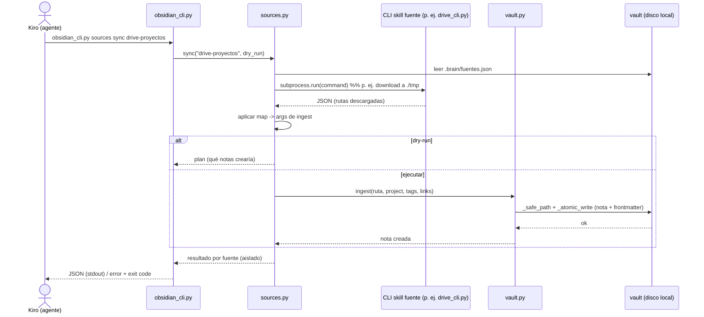

# Design — Skill `obsidian-manager`

## 1. Visión general

Skill autocontenido bajo `skills/workspace/obsidian-manager/` que expone un CLI Python
(`obsidian_cli.py`) para construir y mantener un **second brain** en un vault local de Obsidian.
El `SKILL.md` instruye al agente sobre qué subcomando ejecutar y cómo parsear la salida JSON.

Principios de diseño:
- **Separación de capas**: CLI (parseo/UX) → cliente de vault (lógica de notas/grafo) → utilidades (frontmatter, slug, paths).
- **100% local, sin red, sin dependencias externas** (solo stdlib): cumple RNF-1 y elimina superficie de supply chain.
- **Seguridad primero**: escritura confinada al vault (anti path-traversal), escritura atómica, sin borrado permanente (solo `.trash/`), confirmaciones y `--dry-run`, sin contenido de notas en logs.
- **Desacoplamiento de fuentes**: `ingest` es agnóstico del origen; la orquestación con otros skills vive en configuración (`sources`), no en el núcleo.

## 2. Componentes

```
scripts/
├── obsidian_cli.py    # Capa CLI: argparse, subcomandos, --pretty/--dry-run/--yes,
│                      #   códigos de salida, serialización JSON. Sin lógica de dominio.
├── vault.py           # VaultClient: resolución/validación del vault, CRUD de notas,
│                      #   búsqueda, grafo (backlinks/outlinks/orphans), daily, tasks,
│                      #   proyectos, ingesta. Escritura atómica y anti path-traversal.
├── frontmatter.py     # Parseo/serialización de frontmatter YAML mínimo (round-trip),
│                      #   sin dependencias: soporta escalares, listas y fechas ISO.
├── markdown_index.py  # Índice del vault: extracción de wikilinks [[...]], tags (#tag y
│                      #   frontmatter tags:), aliases; construcción del grafo de enlaces.
└── sources.py         # Registro de fuentes (fuentes.json) y orquestación: invoca el CLI
                       #   de otro skill por su ruta y mapea su salida a ingest (adaptador).
tests/
├── test_frontmatter.py     # round-trip de frontmatter (escalares/listas/fechas).
├── test_vault.py           # init, note create/append/update, colisiones, atomicidad.
├── test_markdown_index.py  # wikilinks, tags, aliases, backlinks, orphans, enlaces rotos.
├── test_ingest.py          # ingesta texto/markdown/binario, --project, --link, stdin.
├── test_tasks_daily.py     # daily --add, task add/list/done, filtros.
├── test_paths.py           # validación anti path-traversal (rechazo de .. y absolutas).
└── test_sources.py         # sources list/sync con skill fuente mockeado (sin red).
```

### 2.1 `frontmatter.py`
- `parse(text) -> (frontmatter: dict, body: str)`: si el archivo empieza con `---`, parsea el
  bloque YAML hasta el siguiente `---`; si no, `frontmatter={}` y `body=text`.
- `dump(frontmatter: dict, body: str) -> str`: serializa el bloque `---` + cuerpo.
- Parser YAML **mínimo y propio** (RNF-1): soporta `clave: valor` (str/int/bool/fecha ISO),
  listas en bloque (`- item`) e inline (`[a, b]`). Documenta explícitamente lo NO soportado
  (YAML anidado complejo, anclas) y falla claro si lo encuentra en vez de corromper.
- `merge(base, updates)`: fusiona campos; listas de tags se unen sin duplicar.

### 2.2 `markdown_index.py`
- `extract_wikilinks(body) -> list[str]`: regex de `[[Nota]]` y `[[Nota|alias]]` (toma el target).
- `extract_tags(frontmatter, body) -> set[str]`: tags de `frontmatter['tags']` + inline `#tag`
  (excluyendo `#` dentro de code fences/inline code).
- `build_index(vault) -> Index`: recorre `*.md`, mapea `nombre → ruta`, `alias → nombre`,
  `nota → outlinks`, y calcula `backlinks` invertidos. Base de `graph` y `search --links-to`.
- `resolve_link(target, index)`: resuelve por nombre y por alias; marca `broken` si no existe.

### 2.3 `vault.py`
- `VaultClient(vault_path)`: valida que el vault existe (salvo en `init`) y guarda su `realpath`.
- `_safe_path(rel)`: `(_vault / rel).resolve()`; verifica `startswith(vault_realpath)`; rechaza fuga (RNF-3).
- `_atomic_write(path, text)`: escribe a `path.tmp` y `os.replace` (RNF-4).
- Métodos: `init()`, `create_note(...)`, `append_note(...)`, `update_frontmatter(...)`,
  `update_body(...)`, `search(...)`, `backlinks(...)`, `outlinks(...)`, `orphans()`,
  `daily(...)`, `daily_add(...)`, `task_add(...)`, `task_list(...)`, `task_done(...)`,
  `project_create(...)`, `project_note(...)`, `project_list()`, `ingest(...)`, `trash(name)`, `restore(name)`.
- `slugify(title)`: nombre de archivo seguro (ascii, guiones, sin colisión → sufijo `-2`, `-3`).
- Ingesta binaria: copia a `referencias/adjuntos/` y crea nota-índice con wikilink/embed `![[...]]`.

### 2.4 `sources.py`
- `load_sources(vault)`: lee `<vault>/.brain/fuentes.json`. Cada fuente:
  `{ "name", "skill_path", "command": [...], "map": {"title", "tags", "project", "content_from"} }`.
- `sync(name, dry_run)`: ejecuta `command` vía `subprocess.run` (capturando stdout JSON), aplica
  `map` para construir los argumentos de `ingest`, e ingiere. Fallo de una fuente no aborta el vault (RNF Historia 9.5).
- **No** hay conocimiento de Drive/Sheets/etc. en el código: todo el mapeo es data en `fuentes.json`.

### 2.5 `obsidian_cli.py`
- `argparse` con subparsers y **parser padre reutilizable** para flags globales (`--pretty`,
  `--dry-run`, `--yes`, `--log-level`) aceptados antes o después del subcomando (mismo patrón que `drive_cli.py`, `default=SUPPRESS`).
- Subcomandos: `init`, `note` (`create|append|update`), `search`, `graph` (`backlinks|outlinks|orphans`),
  `ingest`, `daily`, `task` (`add|list|done`), `project` (`create|note|list`), `sources` (`list|sync`), `trash`, `restore`.
- Serializa a JSON en stdout; errores a stderr `{"error": {"type","message"}}` con exit code mapeado.

## 3. Estructura del vault que crea `init`

```
<vault>/
├── .obsidian/            # config mínima para que Obsidian reconozca el vault (no se sobrescribe)
├── .brain/
│   └── fuentes.json      # registro de fuentes (orquestación de skills)
├── .trash/               # papelera reversible (no borrado permanente)
├── index.md              # nota raíz / MOC (Map of Content)
├── inbox/                # captura sin clasificar (default de note create / ingest)
├── daily/                # daily notes YYYY-MM-DD.md
├── proyectos/
│   └── <slug>/_contexto.md
├── referencias/
│   └── adjuntos/         # binarios ingeridos (PDF, imágenes)
├── plantillas/           # plantillas de nota/daily/proyecto
└── pendientes.md         # tareas globales (las de proyecto viven en su _contexto.md)
```

## 4. Flujo de ingesta y orquestación de fuentes



## 5. Manejo de errores

| Situación | Excepción interna | Exit code | Mensaje al usuario |
|---|---|---|---|
| Argumentos inválidos | `ValueError` (argparse) | 2 | Uso incorrecto + ayuda |
| Vault de solo lectura / sin permiso de escritura | `PermissionError` | 3 | "Sin permisos de escritura sobre el vault" |
| Vault o nota no encontrada | `NotFoundError` | 4 | "No encontrado: <ref> (¿ejecutó `init`?)" |
| Colisión de nombre / confirmación destructiva faltante | `ConflictError` / `ConfirmationRequired` | 6 | "Existe la nota; elija new/skip/overwrite o use --yes" |
| Ruta fuera del vault (path traversal) | `UnsafePathError` | 2 | "Ruta fuera del vault: rechazada" |
| Fuente inexistente/fallida (sync) | `SourceError` | 2 (aislado) | "La fuente <n> falló; el vault no se modificó" |
| Éxito | — | 0 | Resultado JSON |

- No hay reintentos ni backoff: todas las operaciones son locales de sistema de archivos.
- El vault nunca queda a medias: escritura atómica (`os.replace`).

## 6. Seguridad

- **Confinamiento al vault**: toda ruta destino pasa por `_safe_path` (`realpath` + `startswith`); se rechazan `..` y absolutas que escapen (RNF-3).
- **Sin red y sin secretos**: el skill no abre sockets ni lee credenciales. `sources sync` solo invoca otros CLIs del repo por su ruta (no expone tokens; el skill fuente gestiona su propia auth).
- **Sin borrado permanente**: `trash` mueve a `.trash/` (con timestamp para evitar colisión); `restore` revierte. No hay `os.remove` de notas del usuario.
- **Confirmación/dry-run**: `note update --body`, `overwrite` de nota y lotes >10 exigen `--yes` o `--dry-run`.
- **Logs sin contenido**: `logging` estructurado (clave=valor) registra rutas/acciones, nunca el cuerpo de una nota.
- **Escritura atómica** para integridad del vault (RNF-4).

## 7. Decisiones de diseño

- **Vault inyectado en `VaultClient`**: los tests operan sobre `tmp_path`, sin tocar el vault real (RNF-5).
- **Parser de frontmatter propio y mínimo**: evita dependencia de PyYAML y auditoría de supply chain (RNF-1). Se documenta el subconjunto soportado y falla explícito ante YAML fuera de alcance en vez de corromper.
- **Ingesta agnóstica del origen**: `ingest` no sabe de Drive; recibe archivos/texto ya en disco. Esto hace que "cada skill nuevo = nueva capacidad del brain" se logre registrando una fuente en `fuentes.json`, sin tocar el núcleo (Historia 9, decisión clave del usuario).
- **Orquestación por configuración (`sources`)**: adaptador delgado guiado por data; el agente también puede encadenar skills manualmente. Mantiene la separación de capas de la arquitectura del repo.
- **JSON por defecto**: el consumidor primario es el agente; `--pretty` para humanos.
- **CLI sin lógica de dominio**: la lógica vive en `vault.py`/`markdown_index.py`, reutilizable y testeable.

## 8. Registro de fuentes — ejemplo (`.brain/fuentes.json`)

```json
{
  "sources": [
    {
      "name": "drive-proyectos",
      "description": "Descarga material de proyectos desde Google Drive e ingiere como notas",
      "skill_path": "skills/workspace/google-drive-manager/scripts/drive_cli.py",
      "command": ["download", "<FOLDER_ID>", "./.brain/tmp/drive", "--recursive", "--export", "md"],
      "map": { "content_from": "downloaded", "project": "ciencuadras", "tags": ["drive", "ingesta"] }
    }
  ]
}
```

> El bloque anterior es **datos**, no código. Añadir una fuente nueva (Sheets, Langfuse, etc.) es
> editar este JSON; el código de `sources.py` no cambia.

## 9. Dependencias

Ninguna externa. Solo biblioteca estándar de Python 3.12+ (`argparse`, `json`, `pathlib`, `re`,
`os`, `datetime`, `logging`, `subprocess`, `tempfile`). Por tanto **no** hay `requirements.txt`
con paquetes de terceros; si en el futuro se añade uno, se pinnea exacto y se instala desde el
mirror institucional JFrog, documentándolo en el README y el CHANGELOG.
