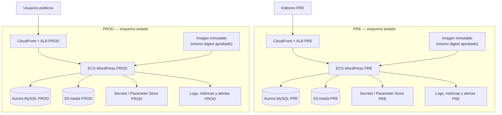

# Plan de reactivación del WordPress legado de Ciencuadras: PRE/PROD y migración EFS → S3

| Campo | Valor |
|---|---|
| Estado | Propuesta de planificación; **no ejecutada** |
| Fecha de corte de evidencia | 2026-09-21 |
| Alcance | WordPress legado de Ciencuadras que hoy opera en producción |
| Región objetivo | `us-east-1` |
| Ambientes a habilitar por esta iniciativa | **PRE y PROD únicamente** |
| Fuera de alcance | Crear DEV/STG, cambiar DNS productivo, borrar EFS, aplicar Terraform o modificar recursos existentes |

> **Cuenta fuente y alcance confirmado.** La reactivación del WordPress legado se realiza íntegramente en **`Soluciones Bolívar S.A.S Ciencuadras` (`290296201161`)**, usando el perfil AWS CLI `ciencuadras`. En esta misma cuenta están el PROD activo (`www-ecs-ciencuadras-wordpress`) y el PRE legado (`pre-ecs-ciencuadras-wordpress`), hoy inoperante porque su EFS fue eliminado. La evidencia, costos y ruta de corrección están en [evidencia AWS en vivo](./evidencia-aws-wordpress-legado-2026-09-21.md).

---

## 1. Decisión que documenta esta memoria

Se requiere reactivar y gobernar el WordPress legado de Ciencuadras con estas condiciones:

1. Mantener **PRE y PROD**; no crear componentes de WordPress para DEV ni STG.
2. En la hora cero, PRE debe reproducir la **topología, artefacto, configuración funcional, archivos y contenido** de PROD.
3. Sustituir la persistencia de medios que hoy dependa de EFS por S3. El objetivo no es reemplazar EFS por otro directorio mutable: los medios van a S3; core, temas y plugins deben quedar en la imagen inmutable.
4. Declarar la infraestructura nueva mediante Terraform y condicionar su existencia a `pre` y `prod`.
5. Inventariar y adoptar con seguridad los componentes ya creados por CloudFormation o por consola. No se debe crear en Terraform un duplicado de un recurso existente ni cambiar de propietario un recurso sin plan de adopción.
6. Conservar una ruta reversible: EFS no se elimina hasta completar pruebas, aceptación y periodo de retención acordado.

La iniciativa está relacionada con la plataforma transversal de WordPress, pero este documento describe el **legado específico de Ciencuadras**. Las decisiones comunes de plataforma continúan en [PRD WordPress Multitenant](../wordpress_multitenant/PRD-wordpress-multitenant-grupo-bolivar.md), [diseño](../wordpress_multitenant/design.md) y [plan de tareas](../wordpress_multitenant/tasks.md).

### 1.1 Estrategia transitoria mientras se define WordPress Multitenant

No existe una fecha confirmada para la plataforma WordPress Multitenant transversal. Por ello, la reactivación PRE y la migración EFS → S3 en la cuenta actual `290296201161` son una **alternativa de corto plazo**: resuelven la indisponibilidad actual sin esperar una definición corporativa y deben reutilizar, en lo posible, los principios de la plataforma futura (imagen inmutable, media en S3, separación PRE/PROD, observabilidad y promoción controlada).

Esta alternativa no reemplaza ni condiciona la iniciativa Multitenant. Debe quedar preparada para que, cuando exista una decisión transversal, el contenido, los artefactos versionados, los manifests y la automatización puedan migrarse sin volver a depender de EFS.

### 1.2 Garantía exclusiva antes de retirar EFS

El EFS de PROD **solo podrá eliminarse después de demostrar que S3 funciona correctamente en producción**, no por completar una copia, reducir costos, vencer una ventana ni aprobar un `terraform plan`. La garantía requiere, como mínimo:

1. Los medios históricos y nuevos se leen, cargan, reemplazan y eliminan desde S3 mediante la ruta CDN esperada, sin errores funcionales ni URLs rotas.
2. Las task definitions y tareas de PRE y PROD que atienden WordPress ya no montan EFS; no queda ningún consumidor confirmado del filesystem.
3. El manifest de migración, los conteos, tamaños y checksums de muestra coinciden, y se prueba restauración de objetos S3.
4. Las métricas de aplicación, S3, CloudFront/ALB y errores de WordPress cumplen los umbrales acordados durante el periodo de estabilización aprobado.
5. Mercadeo/UX, Operación, Seguridad e Infraestructura aceptan explícitamente el resultado, y el procedimiento de rollback se prueba antes del retiro.

Hasta cumplir los cinco criterios, EFS permanece disponible, protegido y recuperable. La eliminación es el último paso, no una actividad de la migración inicial.

### 1.3 Propiedad IaC y recomendación directa por repositorio

La evidencia AWS demuestra que `www-efs-ciencuadras-wordpress` fue creado y sigue siendo propiedad del stack **CloudFormation** homónimo; el EFS `fs-ae7b375b`, sus mount targets y su security group llevan esa propiedad. La revisión de [`ciencuadras-infra`](https://github.com/segurosbolivar/ciencuadras-infra) no encontró una declaración EFS, por lo que no hay evidencia de que este filesystem haya sido creado o sea administrado por Terraform.

Recomendaciones directas:

- **`ciencuadras-infra`:** usarlo para incorporar, de forma condicional para `pre` y `prod`, los recursos nuevos de corto plazo: buckets/prefijos S3 de media, KMS, IAM, DataSync, observabilidad y configuración no colisionante. No declarar allí un `aws_efs_file_system` para `fs-ae7b375b` ni recursos homónimos del stack CloudFormation actual.
- **Stacks CloudFormation `www-*` y `pre-*`:** mantenerlos como dueño de los recursos existentes hasta decidir entre adopción controlada por Terraform (importación seguida de `terraform plan` sin cambios) o servicio paralelo con nombres nuevos. No mezclar ambos mecanismos sobre el mismo recurso.
- **`servicios-ciencuadras-networking-infra`:** conservarlo como referencia de red para cuentas separadas; no es el repositorio de la corrección corta dentro de `290296201161`.
- **`ciencuadras-wp`:** no es fuente suficiente para reconstruir el artefacto porque su rama principal solo expone README; el digest y la configuración que corre deben extraerse del inventario ECS/ECR antes de construir la imagen nueva.

---

## 2. Identificación de cuentas, alcance y evidencia

### 2.1 Mapa de cuentas

| Rol | Cuenta | ID | Evidencia disponible | Estado para esta iniciativa |
|---|---|---:|---|---|
| **PROD legado activo** | Soluciones Bolívar S.A.S Ciencuadras | `290296201161` | Inventario AWS en vivo: `www-ecs-ciencuadras-wordpress` activo y saludable. | Fuente de la migración a S3 y referencia de paridad. |
| **PRE legado a reactivar** | Soluciones Bolívar S.A.S Ciencuadras | `290296201161` | Inventario AWS en vivo: `pre-ecs-ciencuadras-wordpress` existe, pero falla al montar su EFS eliminado. | Alternativa de corto plazo: reconstruirlo sobre S3 en la cuenta actual. |
| **Cuenta transversal DEV** | Servicios-Bolivar-Ciencuadras-DEV | `383946777605` | Inventario corporativo y confirmación del usuario. | Referencia de la línea de negocio; no se habilitan recursos WordPress en DEV por este plan. |
| **Cuenta transversal STG** | Servicios-Bolivar-Ciencuadras-STG | `751835846961` | Inventario corporativo. | Referencia de inventario; sin creación WordPress dentro de este plan. |
| **Cuentas de evolución** | Servicios-Bolivar-Ciencuadras-PRE / Seguros-Bolivar-ciencuadras-PROD | `805516213253` / `844669095517` | Inventario corporativo y documentos de migración de datos/red. | Permanecen registradas para una eventual decisión de migración de cuenta. |

**Precisión importante:** el informe de PROD excluye otros ambientes que conviven en la cuenta `290296201161`; el PRD transversal indica que el **WordPress de Ciencuadras** solo tiene PROD activo. Ambas afirmaciones son compatibles: la cuenta legada es compartida, pero eso no demuestra que hoy exista un WordPress PRE utilizable.

### 2.2 Snapshot técnico comprobado del origen

La evidencia de solo lectura en [análisis de rightsizing](./analisis-rightsizing-infra-prod.html) muestra:

- Región: `us-east-1`.
- Servicio WordPress: `www-wordpress` en `www-cluster-ciencuadras`.
- Escalamiento actual registrado: mínimo 2, máximo 10, promedio histórico aproximado de 3,3 tareas.
- Configuración observada: 2 vCPU / 4 GB por tarea; el informe propone revisar la CPU hacia 1 vCPU manteniendo 4 GB, pero esa recomendación **no debe aplicarse dentro de este proyecto sin su propio gate de desempeño**.
- Dependencias de la capa `www`: CloudFront, ALB, ECS Fargate y Aurora MySQL. Existe un `www-redis` compartido en la cuenta, pero no se validó que WordPress lo consuma; por ello no se asume como dependencia del legado.

### 2.3 Evidencia de repositorios del equipo Ciencuadras

El listado vivo del equipo está disponible en [GitHub Team Cien Cuadras](https://github.com/orgs/segurosbolivar/teams/cien-cuadras/repositories). Para esta iniciativa los repositorios que requieren revisión controlada son:

| Repositorio | Rol observado | Uso permitido en este plan | Hallazgo / límite |
|---|---|---|---|
| [`ciencuadras-infra`](https://github.com/segurosbolivar/ciencuadras-infra) | IaC histórica de Ciencuadras | Principal candidato para hallar recursos declarados de la cuenta legada y sus estados Terraform. | Su README enumera `dev`, `stage`, `pre` y `prod` en `290296201161`. La búsqueda de código no encontró `EFS`; `s3.tf` modela buckets de frontend, Lambda, imágenes y backups, no una persistencia WordPress identificable. No prueba que EFS no exista: puede estar fuera del estado, en CloudFormation o en consola. |
| [`servicios-ciencuadras-networking-infra`](https://github.com/segurosbolivar/servicios-ciencuadras-networking-infra) | Red de los ambientes separados | Referenciar red, subredes y outputs existentes mediante remote state o data sources; no mezclar en este repo el ciclo de vida del WordPress. | Contiene `environment/pre/env.pre.tfvars`; la configuración documenta la cuenta PRE `805516213253`. |
| [`servicios-ciencuadras-components-infra`](https://github.com/segurosbolivar/servicios-ciencuadras-components-infra) | Posible repositorio de componentes | Validar con el equipo si es el repositorio dueño de componentes de PRE/PROD. | En `master` solo se encontró README; no debe asumirse como fuente de verdad de IaC. |
| [`ciencuadras-wp`](https://github.com/segurosbolivar/ciencuadras-wp) | Posible código WordPress | Confirmar origen de imagen, versión de core, temas y plugins. | En `master` solo se encontró README; no es suficiente para reconstruir el sitio. |
| [`ciencuadras-principal-db-cloud`](https://github.com/segurosbolivar/ciencuadras-principal-db-cloud) | Cambios de Aurora MySQL de Ciencuadras | Consultar únicamente si el inventario de task definition confirma que su instancia/base sirve a WordPress. | El nombre no prueba que sea la base del CMS; no cambiar sin trazar la conexión real. |

La rama `master` o el nombre de un repositorio no son prueba de que su contenido sea el que corre en producción. La tarea de descubrimiento debe correlacionar: imagen/digest de ECS, task definition, variables de entorno, recursos montados, estado Terraform, stacks CloudFormation y tags de AWS.

---

## 3. Estado objetivo y definición de paridad de la hora cero

### 3.1 Arquitectura objetivo



El diagrama representa el **estado final**: PRE y PROD son despliegues aislados del mismo esquema lógico. No comparten buckets, bases de datos, secretos, roles, rutas de tráfico ni recursos de observabilidad. La copia EFS → S3 y DataSync pertenecen únicamente al runbook de migración; no forman parte de la arquitectura objetivo.

Redis se omite deliberadamente de la arquitectura base. Aunque existe un `www-redis` en la capa compartida de la cuenta, no se validó una relación directa entre ese recurso y la task definition, imagen o configuración del WordPress legado. Solo se podrá incorporar una caché externa después de comprobar la necesidad mediante inventario de plugins/configuración o una PoC; si se aprueba, deberá ser una instancia o partición aislada por ambiente y se actualizarán el diagrama, IaC y costo.

En ambos ambientes se exige la misma composición funcional y el mismo artefacto aprobado; las diferencias admitidas son exclusivamente valores propios del ambiente y, si se aprueba, parámetros de capacidad.

- Imagen de contenedor de igual digest, con WordPress core, tema y plugins aprobados.
- Medios bajo prefijos o buckets segregados por ambiente; sin acceso cruzado.
- Base de datos propia por ambiente; PRE arranca desde un corte de PROD, se sanea y luego se desacopla.
- Roles IAM, llaves KMS, secretos, dominios, certificados y endpoints propios por ambiente.
- Observabilidad, auditoría y alarmas por ambiente.

### 3.2 Qué significa “exactamente la misma estructura”

La paridad de hora cero debe evaluarse con un manifiesto, no por similitud visual.

| Dimensión | Debe coincidir entre PRE y PROD en hora cero | Debe ser distinta por seguridad/operación |
|---|---|---|
| Aplicación | Digest de imagen, versión PHP/WP, tema hijo, plugins, configuraciones funcionales aprobadas, rutas y reglas de rewrite. | URLs canónicas, `WP_HOME`, `WP_SITEURL`, identificadores de cuenta, roles IAM y secretos. |
| Archivos / medios | Árbol de `wp-content/uploads`, conteo, tamaños y hashes de muestra; redirects y rutas públicas previstas. | Bucket/prefijo, KMS key, propietario de objetos y URLs de CDN si el dominio cambia. |
| Contenido | Páginas, posts, taxonomías, media vinculada, configuración editorial necesaria para reproducir el sitio. | Datos personales, usuarios privilegiados, tokens, webhooks, correos de salida, pagos, integraciones de escritura y llaves API. |
| Infraestructura | Mismos componentes lógicos: borde, balanceo, tarea ECS, base, S3, secretos, observabilidad y reglas de seguridad. | Account ID, CIDR/subredes, DNS/certificados, escalamiento si se aprueba un perfil no productivo, WAF y alarmas específicas. Una caché externa solo se incorpora si se valida su necesidad. |
| Capacidad | El esquema de autoscaling y las pruebas deben ser equivalentes funcionalmente. | La cantidad de tareas puede ser menor en PRE **solo si se acepta explícitamente**; la paridad de topología no exige cobrar la capacidad máxima de PROD. |

> **Regla de datos:** “mismo contenido” no autoriza copiar secretos ni datos personales de producción sin clasificación, autorización y sanitización. Si el dump incluye PII, se debe enmascarar/anonimizar antes de habilitar acceso editorial en PRE, rotar credenciales y deshabilitar acciones salientes. PRE debe llevar `noindex`, impedir crawling y bloquear correo, pagos, CRM y webhooks productivos o dirigirlos a sandbox.

### 3.3 Artefactos de paridad exigidos antes de habilitar PRE

1. Inventario firmado de imagen, plugins, temas, MU-plugins, versión WP/PHP y configuración.
2. Inventario de `wp-content` clasificado por tipo de persistencia.
3. Manifest de objetos: ruta relativa, tamaño, fecha y checksum para los medios migrados.
4. Snapshot/restauración de base documentado, con evidencia de saneamiento y rotación de secretos.
5. Matriz de diferencias intencionales PRE vs PROD aprobada por Seguridad, Mercadeo/UX y operación.
6. Pruebas funcionales: lectura de páginas, biblioteca de medios, carga/reemplazo/borrado de imagen, thumbnails, cron, cache, SEO, enlaces y accesos editoriales.

---

## 4. Diseño de persistencia: EFS solo como fuente temporal; S3 como destino de medios

### 4.1 Clasificación obligatoria de datos antes de migrar

| Ubicación / tipo esperado | Destino | Decisión |
|---|---|---|
| `wp-content/uploads/**` y media editorial | S3 por ambiente, servido por CDN | **Migrar**. Es el candidato natural a object storage. |
| Core de WordPress, temas, plugins y MU-plugins | Imagen inmutable en ECR | **No migrar a S3 como filesystem de ejecución**. Se construyen y versionan en la imagen; elimina registros manuales tras reinicios. |
| Cache, sesiones temporales, `upgrade/`, archivos temporales y thumbnails regenerables | Almacenamiento efímero o reconstrucción controlada; una caché externa solo si se valida por plugin/configuración. | **No migrar**. No se asume Redis como dependencia del WordPress legado. |
| Backups y exportaciones aprobadas | S3 cifrado con lifecycle y acceso restringido | Migrar o generar de nuevo según retención. No exponerlos por CDN. |
| `wp-config.php`, credenciales, llaves, tokens y configuraciones de entorno | Secrets Manager o Parameter Store seguro | **Nunca** mover a S3 ni copiar de PROD a PRE. |
| Cualquier ruta con escritura local obligatoria de plugin | Decisión ADR: refactorizar a S3 o a un servicio externo previamente validado, o conservar EFS **acotado** y justificado | No asumir que un `sync` resolverá semántica POSIX, locks o permisos. |

La decisión de eliminar EFS es válida solo después de confirmar que los plugins no requieren escrituras locales persistentes. El plan transversal ya conserva este punto como decisión explícita: [O0-WP-3](../wordpress_multitenant/tasks.md) (“inmutable puro vs EFS acotado”).

### 4.2 Controles de S3 requeridos

Cada ambiente debe tener bucket o prefijo aislado y una política de mínimo privilegio. Como mínimo:

- Bloqueo completo de acceso público, Object Ownership controlado y cifrado SSE-KMS.
- Versionado y lifecycle definidos para versiones no actuales, backups y objetos transitorios; retención coherente con la clasificación de datos.
- CloudFront mediante Origin Access Control; no servir el bucket públicamente.
- Rol de la tarea ECS restringido al prefijo de medios de su ambiente: solo las acciones S3 indispensables.
- Roles de DataSync separados para origen y destino, con política de bucket de alcance mínimo para la transferencia entre cuentas.
- Logs, inventario S3 o reporte de DataSync que permitan comprobar objetos y fallas; alarmas de errores de acceso o replicación.
- URLs de media, CDN y redirecciones planeadas para preservar SEO. No cambiar URL pública masivamente sin mapa y pruebas.

La migración a S3 no conserva automáticamente atributos de POSIX, ownership Unix, hard links ni la semántica de directorios de EFS. Por ello solo se debe usar para objetos que WordPress trata como medios y no como filesystem ejecutable.

---

## 5. Runbook de migración EFS → S3

### Fase 0 — Descubrimiento y freeze de diseño

**Objetivo:** conocer el estado real antes de declarar recursos nuevos.

1. Renovar SSO del perfil `ciencuadras` antes de cualquier consulta AWS y usar la [evidencia AWS en vivo](./evidencia-aws-wordpress-legado-2026-09-21.md) como línea base: EFS PROD existe, PRE referencia un EFS eliminado y Cost Explorer ya confirmó el costo real. No aplicar cambios durante este descubrimiento.
2. Identificar todos los EFS file systems, access points, mount targets, security groups y rutas montadas por las task definitions de `www-wordpress`.
3. Identificar imágenes/digests, variables de entorno, volúmenes, plugins, procesos de escritura y tarea de cron.
4. Medir por ruta: número de archivos, bytes, tipos, rutas con symlink, archivos en modificación y tasas de cambio.
5. Identificar buckets ya usados por el sitio, la configuración de offload actual y el dominio/CDN que resuelve los medios.
6. Inventariar recursos por propietario: Terraform state, CloudFormation stack, consola/directo u origen desconocido.
7. Obtener costos reales de los últimos 90 días para EFS, S3, transferencia, CloudFront, ECS, RDS y Redis.

**Gate de salida:** existe una matriz `recurso → propietario actual → acción` y un inventario de ruta EFS que permite separar medios, código, caché y secretos. Si no existe, no se programa cutover.

### Fase 1 — Preparación declarativa y prueba técnica en PRE

1. Crear mediante Terraform los recursos S3, KMS, IAM, políticas CDN y configuración de tarea exclusivamente para `pre` y `prod`.
2. Construir una imagen inmutable desde la fuente confirmada; escanearla y fijar digest.
3. Configurar PRE con `noindex`, sin correo/webhooks/pagos productivos y con secretos exclusivos de PRE.
4. Crear la ubicación y tarea de AWS DataSync desde EFS origen a S3 PRE, limitada al prefijo de medios acordado.
5. Ejecutar sincronización inicial sin alterar PROD y registrar el reporte de transferencia.
6. Restaurar un corte de la base de datos en PRE, sanear datos, rotar secretos y aplicar la matriz de diferencias.
7. Configurar el mecanismo de media offload contra S3 PRE; verificar que un objeto existente carga por CDN y que un nuevo upload termina en S3.

**Gate de salida:** los editores validan contenido y medios de PRE, Seguridad aprueba los controles y el manifest no tiene diferencias no explicadas.

### Fase 2 — Ensayo completo de PRE

1. Repetir sincronización incremental para medir volumen y duración.
2. Simular ventana de escritura congelada: activar mantenimiento editorial, ejecutar último incremental y validar delta cero o justificado.
3. Probar crear, editar, reemplazar y eliminar medios; reconstruir thumbnails; ejecutar cron; invalidar caché; comprobar que no se vuelve a escribir en EFS.
4. Ejecutar escaneo de enlaces y muestra de URLs históricas; probar redirecciones y encabezados de CDN.
5. Probar rollback de configuración: volver temporalmente al origen EFS sin borrar datos de S3.

**Gate de salida:** un ensayo documentado satisface RTO/RPO acordados y no deja medios rotos ni cambios sin reconciliar.

### Fase 3 — Cutover de PROD

1. Programar ventana aprobada, comunicación y criterio de abortar. Realizar backup/snapshot previo y preservar el EFS origen.
2. Ejecutar sincronización inicial mientras PROD sigue operando.
3. Detener únicamente las escrituras que generan divergencia en la ruta de medios; mantener sitio en modo de mantenimiento controlado si el ensayo lo exige.
4. Ejecutar sincronización incremental final y validar reporte, conteo, bytes y checksums de muestra. No comparar ETag como MD5 cuando haya multipart; usar checksums propios o la verificación del servicio.
5. Activar configuración S3/offload mediante cambio versionado de imagen/task definition; desplegar con mecanismo de rollback aprobado.
6. Hacer pruebas sintéticas y funcionales: páginas de alto tráfico, biblioteca media, uploads, carga de imágenes, cron, cache, log de errores y observabilidad.
7. Rehabilitar escritura; vigilar 24–72 horas según SLO y volumen de cambios.

**Gate de salida:** Mercadeo/UX, operación y Seguridad aceptan el servicio; la tasa de errores, enlaces rotos y accesos S3 está dentro del umbral acordado.

### Fase 4 — Retiro controlado de EFS

1. Mantener EFS en modo read-only o sin montarlo, con backup recuperable, durante el periodo de reversibilidad aprobado.
2. Validar restauración de al menos una muestra de medios S3 y el procedimiento de recuperación.
3. Comparar la factura de EFS contra el presupuesto y confirmar que no queda cliente dependiente.
4. Solo con aprobación explícita, retirar mount points, access points, security groups y finalmente el file system. Registrar el cambio y actualizar la matriz de propiedad.

> No se borra EFS en la misma ventana en la que se cambia a S3. Un `terraform destroy`, eliminar el file system desde consola o retirar un stack CloudFormation sin comprobar dependencias es un cambio destructivo y queda fuera de este plan documental.

---

## 6. Terraform: creación condicional para PRE y PROD

### 6.1 Principios

- Usar Terraform como dueño de recursos nuevos y módulos institucionales con versión fijada; no crear componentes manualmente.
- Mantener red en su repositorio dueño; consumir VPC, subredes, DNS y outputs mediante remote state o data sources de solo lectura.
- Modelar el WordPress como un componente con configuración por ambiente. PRE y PROD tienen recursos separados, roles separados, secretos separados y state separado.
- No habilitar recursos WordPress en `dev` o `stage`, aunque esos valores continúen existiendo en la raíz histórica.
- No usar `count` o `for_each` para “ocultar” un recurso cuya creación previa está fuera de state: primero inventariar e importar/adoptar o tratarlo como data source.

### 6.2 Patrón de condición recomendado

Si la raíz histórica todavía recibe `dev`, `stage`, `pre` y `prod`, el módulo de WordPress debe obtener una configuración solo para los dos ambientes permitidos:

```hcl
locals {
  wordpress_by_environment = {
    pre = {
      desired_count = 2
      max_count     = 2
      media_prefix  = "wordpress-media/"
    }
    prod = {
      desired_count = 2
      max_count     = 10
      media_prefix  = "wordpress-media/"
    }
  }

  wordpress_config = try(local.wordpress_by_environment[var.stack_id], null)
}

resource "aws_s3_bucket" "wordpress_media" {
  for_each = local.wordpress_config == null ? {} : {
    (var.stack_id) = local.wordpress_config
  }

  bucket = "${var.layer}-${each.key}-wordpress-media"
  tags   = merge(var.tags, { Environment = each.key })
}
```

El fragmento es ilustrativo, no código listo para aplicar. La implementación final debe usar las variables, módulos versionados y convenciones del repositorio dueño. Para un repositorio dedicado exclusivamente a WordPress, se puede endurecer la validación de `environment` a `pre` y `prod`; para la raíz histórica, el patrón anterior permite conservar otros ambientes sin crear recursos WordPress en ellos.

### 6.3 Recursos que el módulo debe gobernar

| Grupo | PRE | PROD | Nota |
|---|---|---|---|
| S3 de media, KMS, lifecycle, políticas y CDN/OAC | Sí | Sí | Aislamiento físico o lógico por ambiente. |
| IAM task role, rol DataSync y políticas de bucket | Sí | Sí | Sin permisos cruzados ni credenciales embebidas. |
| ECS task definition/service y configuración de media | Sí | Sí | Misma imagen de hora cero; escalamiento definido por ambiente. |
| Secrets/Parameter Store | Sí | Sí | Valores distintos; PRE jamás copia secretos de PROD. |
| Observabilidad y alarmas | Sí | Sí | Nombres/tags por ambiente y trazabilidad. |
| EFS nuevo | No | No | No forma parte del estado objetivo. |
| Datos EFS existentes | Solo data source / tarea DataSync después del inventario | Solo data source / tarea DataSync después del inventario | No importar ni destruir a ciegas. |

### 6.4 Recursos que nacieron fuera de Terraform

La cuenta actual contiene infraestructura que puede haber sido creada por CloudFormation y por consola. Para cada recurso se debe llenar una matriz de adopción:

| Campo | Ejemplo de uso |
|---|---|
| ARN / ID y cuenta | `fs-...`, bucket, service, listener, stack, security group, secret o distribución. |
| Función y dependencias | Montaje del WordPress, media, DNS, CDN, red, IAM, backup. |
| Dueño actual | Terraform state, CloudFormation stack, consola/manual o desconocido. |
| Dueño futuro | Se mantiene en su dueño, se referencia como data source, se importa a Terraform o se reemplaza. |
| Plan de transición | Paso previo, ventana, rollback y aprobador. |

Reglas de transición:

1. Si CloudFormation sigue siendo dueño, Terraform solo lo referencia hasta que exista plan de migración de propiedad.
2. Si se adopta un recurso manual, se ejecuta inventario, `terraform import`/bloque `import`, se compara un `terraform plan` sin cambios y solo entonces se modifica de forma declarativa.
3. Si se reemplaza, crear el nuevo recurso, mover consumidores, validar, retirar el anterior y documentar rollback. No mezclar este flujo con el cutover de media sin un gate específico.
4. Etiquetar recursos nuevos con ambiente, sistema, propietario Terraform y centro de costo para reconciliación futura.

### 6.5 DataSync: recomendación de implementación y ciclo de vida

**Recomendación:** declarar DataSync en Terraform, no crear la solución principal manualmente en consola. Terraform debe gobernar las ubicaciones EFS/S3, roles IAM, task, logging, alarmas y etiquetas; así quedan versionados, auditables, repetibles entre PRE y PROD y alineados con el resto de recursos nuevos.

DataSync puede referenciar el EFS actual como **data source** por su ID/ARN, sin intentar tomar propiedad de `fs-ae7b375b`, que continúa bajo CloudFormation. Esta separación evita colisiones con el stack existente y permite remover la tarea temporal sin tocar el filesystem fuente.

| Aspecto | Recomendación |
|---|---|
| Declaración de `LocationEFS`, `LocationS3`, roles IAM y `Task` | Terraform, con recursos separados por ambiente y tags de migración. |
| Ejecución de sincronización | Runbook o pipeline con aprobación humana: `start-task-execution` para inicial, incremental y corte final. No ejecutar copias como efecto implícito de `terraform apply`. |
| Programación automática | Deshabilitada. Las copias deben seguir la ventana aprobada y los gates de PRE/PROD. |
| PRE | Habilitar primero la tarea EFS → S3 PRE para el ensayo y la validación de medios. |
| PROD | Habilitar la tarea independiente EFS → S3 PROD únicamente después del gate PRE y antes del cutover controlado. |
| Retiro de DataSync | Tras cumplir §1.2 y G5, deshabilitar y destruir solamente los recursos DataSync temporales mediante Terraform. Mantener S3, observabilidad y evidencia de migración. |
| Consola | Permitida solo para diagnóstico excepcional aprobado. Cualquier recurso creado así debe importarse/reconciliarse antes de dejarlo operativo. |

Patrón de activación recomendado para el módulo de migración:

```hcl
variable "enable_efs_to_s3_migration" {
  type    = bool
  default = false
}

variable "enable_prod_cutover" {
  type    = bool
  default = false
}

locals {
  datasync_environments = {
    pre  = { enabled = true }
    prod = { enabled = var.enable_prod_cutover }
  }

  enabled_datasync_environments = var.enable_efs_to_s3_migration ? {
    for environment, config in local.datasync_environments :
    environment => config if config.enabled
  } : {}
}

# Las ubicaciones y tareas se declaran con for_each sobre
# local.enabled_datasync_environments. La ejecución se realiza fuera de
# terraform apply, mediante un pipeline o runbook con aprobación.
```

---

## 7. Estimación de costos y fórmula de decisión

### 7.1 Qué está medido y qué no

La cuenta legada fue consultada en vivo con el perfil `ciencuadras`. El [informe de evidencia AWS](./evidencia-aws-wordpress-legado-2026-09-21.md) confirma un costo promedio de EFS de **US$552,08/mes** entre junio y agosto de 2026; el 99,59% proviene de `ETDataAccess`, no del almacenamiento. Esta es la línea base real del caso EFS → S3.

La siguiente referencia procede del [diseño de WordPress Multitenant](../wordpress_multitenant/design.md), que usa tarifas públicas on-demand de `us-east-1` y redondeos. Sirve para estimar el costo de un tenant dedicado; no sustituye el costeo de S3/CDN/DataSync específico del legado ni garantiza por sí sola el ahorro neto. Sus filas de Redis pertenecen al diseño transversal y **no deben contarse como una dependencia ni costo confirmado del WordPress legado** hasta que se valide la necesidad.

| Escenario de referencia | Costo mensual AWS estimado | Incluye |
|---|---:|---|
| PRE por marca | **~US$112** | 2 tareas Fargate 0,5 vCPU/1 GB, Aurora mínima, Redis micro, ALB, S3, Secrets y CDN. |
| PROD por marca | **~US$258–559** | Fargate 2–4 tareas 1 vCPU/2 GB, Aurora según carga, Redis, ALB, S3, Secrets y CDN. |
| PRE + PROD por marca | **~US$370–671** | Suma de ambos ambientes; no incluye costos compartidos. |
| Plataforma compartida | **~US$156** | NAT, WAF y ECR de las dos cuentas; se prorratea entre marcas si no existe ya. |

Para Ciencuadras sola, si se debe crear toda la plataforma compartida, el escenario de referencia sería **~US$526–827/mes**; si los recursos compartidos se reparten entre tres marcas, la parte aproximada para Ciencuadras sería **~US$422–723/mes**. Estos no son costos de “copiar EFS”: incluyen una plataforma WordPress aislada con PRE y PROD.

### 7.2 Delta específico EFS → S3

La decisión financiera debe usar la siguiente fórmula:

```text
Delta mensual = (PRE nuevo + PROD nuevo o ajustado + S3 + solicitudes + CDN/egreso + costo compartido prorrateado)
                - (EFS storage + throughput + backups + transferencias/recursos retirados)

Costo único de migración = (GiB transferidos en todas las ejecuciones DataSync × tarifa vigente DataSync)
                            + solicitudes S3 + snapshots/backups + pruebas + posibles invalidaciones CDN
```

- El modelo transversal redondea **~US$1/mes para ~20 GB de media S3**. Se debe sustituir por volumen, clase de almacenamiento, cantidad de objetos, solicitudes y egress reales.
- AWS DataSync cobra por volumen transferido; la [página de precios vigente](https://aws.amazon.com/datasync/pricing/) debe consultarse al aprobar la ventana. Como referencia de orden de magnitud, un anuncio histórico oficial de AWS publicó **US$0,0125 por GB copiado**; con esa referencia, 100 GiB serían ~US$1,25 y 1 TiB ~US$12,80 por pasada, antes de solicitudes y ejecuciones adicionales. Las sincronizaciones inicial, incrementales y reintentos suman volumen facturable.
- El ahorro final depende del tamaño/ciclo de vida de EFS y de si existen throughput provisionado, backups o consumidores adicionales. No se debe prometer ahorro antes de confirmar esos datos.
- Quedan fuera de estas cifras Cloudflare, licencias de plugins, tiempo del equipo, consultoría, remediación de plugins, impuestos, descuentos, costos de salida altos y cualquier réplica de base de datos no prevista.

### 7.3 Modelo de costos por enfoque

> **Regla de lectura:** los valores “mínimos” solo suman los componentes cuantificables con la evidencia actual. No son un compromiso de costo final: solicitudes S3, tamaño medio de objetos, tasa de cache hit, entrega CloudFront, KMS, versionado, base de datos, cómputo PRE y transferencias posteriores pueden aumentar el total. Los valores se reconfirman con AWS Pricing Calculator y Cost Explorer antes de aprobar ejecución.

#### 7.3.1 Enfoque A — Rehabilitación corta en la cuenta actual `290296201161`

Este enfoque mantiene el PROD legado en la cuenta actual, reconstruye PRE con el mismo esquema final y traslada los medios a S3. No crea una dependencia de Redis ni presupone una migración de cuentas.

| Servicio AWS | Estado con EFS activo | Estado durante EFS + S3 | Estado después de retirar EFS | Impacto de costo esperado |
|---|---|---|---|---|
| EFS `fs-ae7b375b` | **US$552,08/mes** promedio observado (jun–ago 2026); 99,59% es `ETDataAccess`. | Se conserva completo durante ensayo, validación y rollback. | US$0 solo cuando se cumpla §1.2 y G5. | Ahorro bruto potencial de **US$552,08/mes** antes de variables S3/CDN. |
| S3 media PRE/PROD | No existe bucket de media validado para el contenido EFS. | Para 49,3 GiB, almacenamiento Standard de referencia: **~US$1,13/mes** (`49,3 × US$0,023/GB-mes`). | Permanece como almacenamiento de media. | Solicitudes, versionado, lifecycle y objetos nuevos son variables. |
| AWS DataSync | No aplica. | Temporal: una pasada inicial de 49,3 GiB equivale a **~US$0,62** con la referencia de US$0,0125/GB; cada incremental se cobra por volumen copiado. | Se deshabilita y destruye después de G5. | Costo único/temporal, no mensual si no hay schedule. |
| EFS Elastic Throughput de la copia | Costo recurrente de acceso ya observado. | Leer 49,3 GiB para la primera copia añade aproximadamente **~US$1,48**, usando el precio implícito observado de ~US$0,03/GB `ETDataAccess`. | Elimina junto con EFS. | Costo único mínimo de lectura; revisar tras la ejecución. |
| CloudFront / S3 requests / KMS | Costos existentes de cuenta no atribuibles aún solo a WordPress. | Puede cambiar por cache misses, invalidaciones, GET/PUT y cifrado KMS. | Permanece como costo variable del nuevo flujo. | Requiere medir tamaño medio de objeto, requests y cache hit; no se incluye en el mínimo. |
| ECS Fargate / ALB / Aurora | Recursos existentes; PRE está inoperante y su costo real WordPress no se aisló. | Nueva task definition y posible cómputo/BD PRE durante coexistencia. | Continúan con la arquitectura S3. | No se asume ahorro o incremento hasta medir la configuración final. |
| CloudWatch / ECR / CodeBuild / IAM | Existentes. | Logs de DataSync, nuevas imágenes inmutables y alarmas agregan costo marginal. | Se conservan logs/artefactos; IAM no tiene costo directo. | Marginal; incluir en estimación final si se crean recursos nuevos. |

**Escenarios mínimos, separados de costos variables:**

| Escenario en `290296201161` | Recurrencia mínima estimada | Costos variables/excluidos |
|---|---:|---|
| EFS activo hoy | **US$552,08/mes** | CloudFront, S3 y demás servicios de cuenta no atribuibles solo a WordPress. |
| EFS activo + S3 almacenando 49,3 GiB | **~US$553,21/mes** | S3 GET/PUT/LIST, CloudFront, KMS, versionado, DataSync one-time, PRE compute/BD. |
| Primera transferencia DataSync | **~US$2,10 mínimo único** | ~US$0,62 DataSync + ~US$1,48 lectura EFS; faltan requests S3, objetos y deltas. |
| S3 en PROD, EFS retirado después de la garantía | **~US$1,13/mes mínimo** | Todas las variables S3/CDN/KMS y componentes de aplicación. |
| Delta recurrente bruto después de retirar EFS | **~-US$550,95/mes** | No es ahorro neto prometido hasta medir requests, CDN y cargas que no sean media. |

El valor de 17,7–19,5 TB/mes cobrado en EFS no debe trasladarse automáticamente como tráfico S3: primero hay que demostrar qué proporción corresponde a medios de WordPress y cuánto será absorbido por CloudFront. Por eso el ahorro bruto anterior es una hipótesis económica de alto potencial, no una cifra aprobada.

#### 7.3.2 Enfoque B — Migración futura hacia cuentas separadas

Este enfoque solo aplica cuando se apruebe migrar desde `290296201161` hacia `Servicios-Bolivar-Ciencuadras-PRE` (`805516213253`) y/o `Seguros-Bolivar-ciencuadras-PROD` (`844669095517`). Sus costos son **independientes** de la rehabilitación corta: durante la coexistencia se paga el legado en `290296201161` más la infraestructura nueva en destino.

| Grupo de costo en cuentas destino | Servicios AWS afectados | Estado de estimación |
|---|---|---|
| Capa de aplicación | ECS Fargate, ECR, CodeBuild/CodePipeline, ALB, CloudWatch. | Nueva capacidad; se mide con el tamaño final de WordPress. |
| Datos y media | Aurora/RDS MySQL, S3, KMS, backups, DataSync; snapshot/DMS para la BD según el plan de migración aprobado. | Depende del volumen, RPO/RTO y estrategia de BD. |
| Borde y seguridad | CloudFront, WAF, certificados, logs y potencialmente Cloudflare. | Costos de tráfico y reglas por cuenta. |
| Red | NAT Gateway, VPC endpoints, transferencia entre cuentas/TGW cuando aplique. | Debe medirse por arquitectura real; el NAT puede dominar costos fijos. |
| Cache | Ninguno presupuestado para el WordPress legado hasta que se valide. | Redis se excluye del cálculo de referencia siguiente. |

Como referencia de orden de magnitud, el diseño WordPress Multitenant estima PRE+PROD con Redis. Al descontar sus valores de referencia (PRE ~US$12 y PROD ~US$23), el costo de tenant **sin Redis no validado** queda así:

| Escenario futuro de cuentas separadas | Costo mensual AWS de referencia | Alcance |
|---|---:|---|
| PRE por marca, sin Redis | **~US$100** | Fargate, Aurora mínima, ALB, S3, Secrets y CDN; no es medición de la cuenta destino. |
| PROD por marca, sin Redis | **~US$235–536** | Fargate, Aurora según carga, ALB, S3, Secrets y CDN. |
| PRE + PROD por marca, sin Redis | **~US$335–636** | Tenant completo, sin costos compartidos. |
| Plataforma compartida nueva | **~US$156** | NAT, WAF y ECR de dos cuentas, si Ciencuadras asume el 100%. |
| Total si Ciencuadras asume toda la plataforma | **~US$491–792** | Referencia, no cotización. |
| Total si se reparte plataforma entre tres marcas | **~US$387–688** | Usa ~US$52 de prorrateo de plataforma. |

Durante la migración de cuentas, el costo de coexistencia incluye además el EFS legado de `290296201161` (~US$552,08/mes observado) hasta que S3 esté garantizado y el cutover de cada componente haya terminado. Los costos de DMS/snapshot de base de datos, DataSync cross-account, transferencias de red y licencias de plugins se gestionan como líneas separadas; no deben mezclarse con el delta EFS → S3 de la cuenta actual.

### 7.4 Datos requeridos para cerrar el presupuesto real

| Dato | Fuente / permiso | Resultado esperado |
|---|---|---|
| GiB reales por clase EFS, throughput y backups | EFS/CloudWatch + Cost Explorer en `290296201161` | Línea base de ahorro retirando EFS. |
| Tamaño/número de archivos y cambio diario de `uploads` | Montaje EFS y reporte DataSync | Costo único y duración de sincronización. |
| Uso real de Fargate, Aurora, ALB y cualquier caché efectivamente asociada a WordPress | CloudWatch/ECS/RDS y evidencia de configuración de plugin | Sizing de PRE/PROD, sin asumir Redis. |
| Costo por servicio y UsageType de 90 días | Cost Explorer con autorización financiera | Costo mensual actual y delta verificable. |
| Tráfico CDN/egress y requests S3 | CloudFront/S3 Cost Explorer | Variabilidad mensual y costo de SEO/media. |

El rol `ViewOnlyAccess` puede no otorgar Cost Explorer. Se requiere una consulta aprobada por Finanzas/FinOps o un rol que permita lectura de costos, sin necesidad de permisos de escritura.

---

## 8. Plan por gates y criterios de aceptación

| Gate | Entregable | No se puede avanzar si… |
|---|---|---|
| G0 — Acceso e inventario | SSO renovado, inventario de EFS/ECS/S3/CFN/consola, costos 90 días y matriz de propietarios. | No se conoce qué EFS o bucket usa WordPress, o hay recursos sin dueño identificado. |
| G1 — Diseño/adopción Terraform | ADR de persistencia, módulos PRE/PROD, plan sin duplicados, estrategia de recursos manuales/CFN. | `terraform plan` propone crear/reemplazar recursos existentes inesperadamente. |
| G2 — Hora cero PRE | Imagen, DB saneada, media S3 y manifest; matriz de diferencias aprobada. | PRE expone PII, secretos o integraciones de PROD; medios/contenido no coinciden. |
| G3 — Ensayo EFS→S3 | Ensayo completo con incremental, performance, SEO y rollback. | Se pierden objetos, existen URLs rotas o plugins requieren escritura persistente no resuelta. |
| G4 — Cutover PROD | Ventana aprobada, backup, pruebas y observabilidad. | No existe rollback probado o el delta final no está validado. |
| G5 — Retiro EFS | Evidencia de funcionamiento S3 en PROD, ausencia de consumidores EFS, restauración probada, estabilización cumplida y aprobación explícita. | Cualquiera de los cinco criterios de garantía de §1.2 no está comprobado. |

### Criterios de aceptación mínimos

- Cero objetos faltantes del manifest acordado y discrepancias documentadas para elementos regenerables.
- PRE es navegable, no indexable y no dispara integraciones productivas.
- PROD sirve medios desde la ruta S3/CDN esperada y conserva URLs/SEO acordados.
- Cada nuevo upload termina en S3 y sobrevive a redeploy/reinicio de ECS.
- Alertas de acceso denegado S3, 4xx/5xx de CDN/ALB, errores de WordPress y fallos de DataSync son observables.
- Existe restauración probada de medios y configuración de rollback.

---

## 9. Acciones inmediatas recomendadas

1. Usar el perfil `ciencuadras` y `aws-sso-refresh` para renovar la sesión antes de futuras consultas AWS; partir de la evidencia AWS en vivo ya documentada. No aplicar cambios sin los gates de este plan.
2. Obtener de la task definition de `www-wordpress` la fuente de imagen, mounts, access points, variables y roles IAM.
3. Reunir a dueño de WordPress, Infraestructura, Seguridad, FinOps y Mercadeo/UX para aprobar el alcance real de “misma estructura” y la sanitización de PRE.
4. Comparar state de `ciencuadras-infra`, stacks CloudFormation y consola contra el inventario; crear matriz de adopción.
5. Ejecutar una PoC de DataSync/offload solo contra PRE y una copia no productiva de datos antes de calendarizar PROD.
6. Cerrar sizing/costo con métricas de Ciencuadras; no reutilizar sin validación el sizing de Seguros Bolívar ni el de otros servicios de la cuenta.

---

## 10. Fuentes y trazabilidad

### Fuentes internas

- [Inventario de cuentas AWS](../../inventario-cuentas-aws.md), generado el 2026-09-01.
- [Análisis de rightsizing de PROD](./analisis-rightsizing-infra-prod.html), basado en acceso de solo lectura sobre la cuenta legada.
- [Evidencia AWS en vivo del WordPress legado](./evidencia-aws-wordpress-legado-2026-09-21.md), inventario de EFS, ECS, S3, CloudFormation y costos reales de la cuenta `290296201161`.
- [Justificación de CIDR de la nueva PROD](./justificacion-cidr-prod.md).
- [`ciencuadras-infra`](https://github.com/segurosbolivar/ciencuadras-infra), README, estructura de ambientes y archivos inspeccionados en `master`.
- [`servicios-ciencuadras-networking-infra`](https://github.com/segurosbolivar/servicios-ciencuadras-networking-infra), configuración `environment/pre/env.pre.tfvars` inspeccionada en `master`.
- [Diseño y estimación de costos WPMT](../wordpress_multitenant/design.md#52-estimación-de-costos-aws).
- [Plan de tareas WPMT](../wordpress_multitenant/tasks.md), especialmente O0-WP-3, O1-INFRA-1, O1-INFRA-2 y O1-MIG-1.

### Referencias públicas de AWS

- [AWS DataSync pricing](https://aws.amazon.com/datasync/pricing/).
- [Uso de DataSync con Amazon EFS](https://docs.aws.amazon.com/efs/latest/ug/trnsfr-data-using-datasync.html).
- [Amazon S3 pricing](https://aws.amazon.com/s3/pricing/).
- [Anuncio histórico del precio por GB de DataSync](https://aws.amazon.com/blogs/storage/aws-datasync-storage-day-launches-2019/).

La información de AWS se resumió y se debe reconfirmar con precios vigentes y el AWS Pricing Calculator antes de aprobar gasto. Content was rephrased for compliance with licensing restrictions.
