# Design — Plataforma WordPress Multitenant Grupo Bolívar

| Campo | Valor |
|---|---|
| **Producto** | Plataforma WordPress Multitenant (WPMT) Grupo Bolívar |
| **Documento** | Diseño de arquitectura (design.md) |
| **Versión** | 0.1 (Borrador para revisión) |
| **Fecha** | 2026-08-27 |
| **Autor(es)** | Arquitectura Empresarial / Arquitectura de Solución |
| **Basado en** | [`PRD-wordpress-multitenant-grupo-bolivar.md`](./PRD-wordpress-multitenant-grupo-bolivar.md), [`deep-research-validacion.md`](./deep-research-validacion.md), [`deep-research-riesgos.md`](./deep-research-riesgos.md) |
| **Clasificación** | Interno |

> **Cómo leer este documento.** Está organizado de negocio a tecnología. Cada vista tiene un propósito y una audiencia. Las vistas de negocio (§1-§3, §12, §14) explican *por qué* y *qué*; las técnicas (§4-§11) explican *cómo*. Los diagramas usan **Mermaid** (se renderizan en GitHub, VS Code y la mayoría de visores Markdown).

---

## Índice de vistas

| # | Vista | Propósito | Audiencia principal |
|---|---|---|---|
| 1 | Contexto de negocio | La capacidad como servicio interno compartido | Negocio, EA |
| 2 | C4 Nivel 1 — Contexto del sistema | Actores y sistemas externos | Todos |
| 3 | C4 Nivel 2 — Contenedores | Piezas de software y su comunicación | Arquitectura, Tecnología |
| 4 | C4 Nivel 3 — Componentes (plano de control) | Interior del orquestador | Tecnología |
| 5 | Blueprint de despliegue AWS | Cuentas, redes y servicios gestionados | Tecnología, Seguridad |
| 5.1 | Dimensionamiento basado en datos reales | Tamaños de máquina medidos en las cuentas actuales | Tecnología, EA, Finanzas |
| 5.2 | Estimación de costos AWS | Costo por marca/blog y por portafolio | Negocio, Finanzas, EA |
| 6 | Vista de datos | Aislamiento por marca y motor de BD | Tecnología, DBA |
| 7 | Proceso — Promoción de contenido | El flujo del botón → pipeline | Negocio, Tecnología |
| 8 | Proceso — Ciclo de vida de plugins/versiones | Build inmutable | Tecnología, WPMT |
| 9 | Proceso — Onboarding de nueva marca | Alta repetible de tenant | WPMT, EA |
| 9.1 | Proceso DevOps end-to-end | Lo que ejecuta el equipo de plataforma (CI/CD, deploy, parches, rollback) | DevOps, WPMT, Tecnología |
| 9.2 | Catálogo de plugins y fuentes confiables | Plugins transversales vs por marca, licenciamiento y procedencia segura | WPMT, Seguridad, Mercadeo |
| 10 | Blueprint de seguridad | Defensa en profundidad | Seguridad, Compliance |
| 11 | Vista de red y tráfico | Flujo de una petición pública | Tecnología, Seguridad |
| 12 | Service blueprint | Front-stage / back-stage del servicio | Negocio, WPMT |
| 13 | Modelo operativo y RACI | Quién hace qué | Negocio, WPMT, EA |
| 14 | Roadmap por olas | Secuencia de adopción | Negocio, EA |
| 15 | Decisiones → riesgos mitigados | Trazabilidad de decisiones | EA, Gobierno de TI |
| 17 | Glosario | Siglas y términos usados en el documento | Todos |

---

## 1. Vista de contexto de negocio

La plataforma se ofrece como una **capacidad compartida** ("Gestión de Presencia Digital de Marca as-a-Service"): un equipo central opera la plataforma y las líneas de negocio consumen el servicio conservando autonomía sobre su contenido.

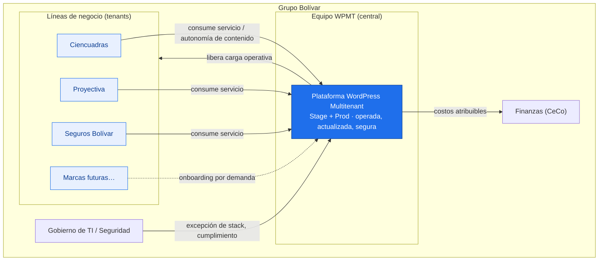

**Valor de negocio:**
- Las líneas dejan de mantener soluciones de caja → se enfocan en producto.
- Operación técnica unificada → elimina la curva de aprendizaje de ~2 meses por rotación.
- Ambiente de validación (Stage) para todas las marcas → menos errores en Producción.

---

## 2. C4 Nivel 1 — Diagrama de contexto del sistema

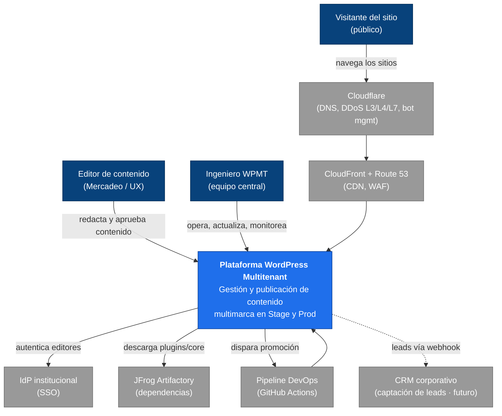

---

## 3. C4 Nivel 2 — Diagrama de contenedores

Cada marca es una instancia aislada. Un plano de control común gobierna el ciclo de vida. Se muestra una marca como ejemplo; el patrón se replica por tenant y por ambiente.

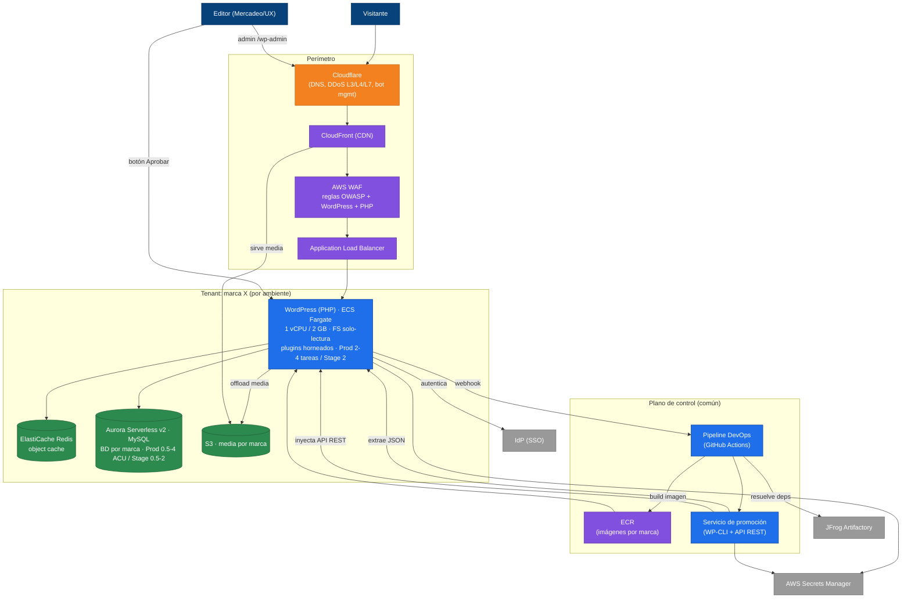

---

## 4. C4 Nivel 3 — Componentes del plano de control

Interior del orquestador que gobierna build, promoción y onboarding.

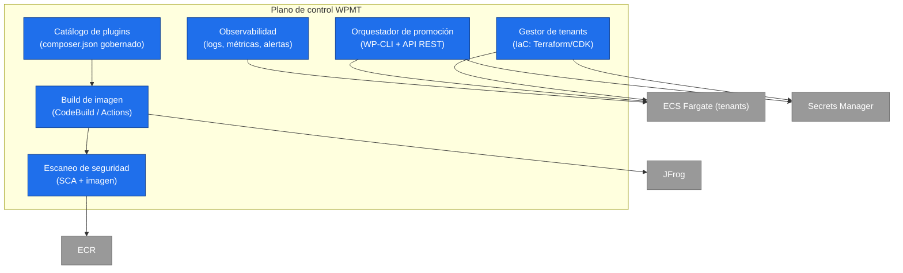

---

## 5. Blueprint de despliegue AWS

Dos cuentas dedicadas (Stage y Prod), región us-east-1. Aislamiento por marca dentro de cada cuenta. **Cloudflare** como capa de protección perimetral delante de CloudFront (DNS autoritativo, DDoS L3/L4/L7, bot management).

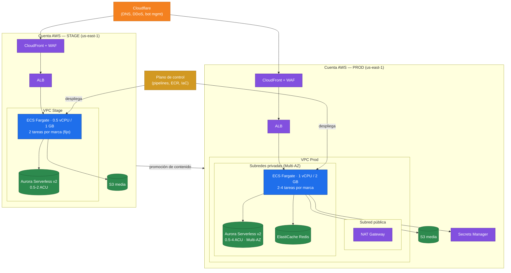

---

## 5.1 Dimensionamiento basado en datos reales (Seguros Bolívar)

> Fuente: medición directa vía CloudWatch (rol `ViewOnlyAccess`) sobre las cuentas **Portal Web PROD (982536497151)** y **STG (536430096367)**, us-east-1, ventana de 30 días (agosto 2026). El WordPress actual del portal corre en `*-portales-bolivar-ecs-cluster` (servicio `ecs-portales-bolivar-wordpress-service`) sobre **ECS Fargate + Aurora MySQL** — lo que ya valida las decisiones del PRD (Fargate + MySQL).

### 5.1.1 Estado actual medido

| Métrica | PROD (982536497151) | STG (536430096367) |
|---|---|---|
| Tarea Fargate (actual) | 2 vCPU / 4 GB | 0.5 vCPU / 1 GB |
| Tareas (desired/running) | **1 / 1** (sin redundancia) | 2 / 2 |
| Autoscaling actual | min 1 · max 12 · target 60% CPU y 60% mem | min 2 · max 8 |
| CPU servicio (30d) | Avg **3.3%** · Max 99% | Avg 10.3% · Max 100% |
| Memoria servicio (30d) | Avg 10.2% · Max 21.9% | Avg 7.6% · Max 34.2% |
| Tráfico ALB (30d) | ~487k req · **15.7k/día** · pico-día 43k | ~16k req · 679/día |
| RPS instantáneo (pico 5min) | **~3.5 RPS** (p99 1.4) | ~0.1 RPS |
| Latencia backend | Avg 352 ms · Max ~60 s (timeouts puntuales) | — |
| Aurora MySQL (PROD) | `prod-portales-wordpress-1` · db.t3.medium · CPU Avg 12% Max 35% · ~35 conex. pico | `stage-portales-wordpress-1` · db.t3.medium |

### 5.1.2 Lectura de los datos

- **El tráfico real es modesto:** ~3.5 RPS de pico instantáneo en PROD. La carga base es muy baja (CPU 3.3% promedio).
- **Los picos de CPU (99%)** no vienen del tráfico web (que es bajo) sino de tareas internas de WordPress (cron, regeneración de caché/thumbnails, plugins). Esto refuerza el patrón de **Media Offload + object cache** del diseño.
- **Memoria sobredimensionada:** 4 GB para usar ~1 GB de pico. Hay margen para ajustar.
- **Riesgo de resiliencia actual en PROD:** corre con **una sola tarea** (desired=1). Un fallo de esa tarea/AZ deja el sitio abajo hasta que Fargate la reprograme. STG, irónicamente, tiene más redundancia (2 tareas).
- **Aurora holgada:** CPU pico 35%, ~35 conexiones. No necesita instancias grandes; es un candidato ideal para **Serverless v2** que escala por demanda.

### 5.1.3 Dimensionamiento recomendado (resiliente y escalable)

Principio: dimensionar para el **pico real + cabecera de campaña**, con **mínimo 2 tareas en Multi-AZ** para resiliencia (corrige el punto débil actual de PROD), y dejar que el autoscaling absorba los picos.

| Componente | PROD recomendado | STG recomendado | Justificación |
|---|---|---|---|
| **Tarea Fargate (WordPress)** | 1 vCPU / 2 GB por tarea | 0.5 vCPU / 1 GB | El uso real cabe en 1 vCPU/2 GB; se baja de los 2 vCPU/4 GB actuales sin perder cabeza. La escala se da por número de tareas, no por tareas gigantes |
| **Nº de tareas (base)** | **mín 2, máx 4** | **mín 2, máx 2** | Mínimo 2 en distintas AZ = sin punto único de fallo. Máx 4 en Prod cubre ~10x el pico actual; Stage fijo en 2 (ambiente de validación, sin necesidad de escalar) |
| **Autoscaling** | Target 60% CPU + política por RPS/ALB request-count-per-target; cooldown 60s | Igual, escala menor | Combinar CPU con requests-per-target reacciona mejor a picos de tráfico que solo CPU |
| **Base de datos** | **Aurora Serverless v2**, rango **0.5–4 ACU** (Prod), Multi-AZ (1 writer + 1 reader) | Aurora Serverless v2, **0.5–2 ACU**, single-AZ | El uso real (CPU 35% pico) cabe sobrado; Serverless v2 escala en segundos y en Stage consume el mínimo cuando está inactivo |
| **Object cache** | ElastiCache Redis (cache.t4g.small) | cache.t4g.micro o compartido | Saca `wp_options`/transients de la BD (mitiga el pico de CPU interno) |
| **Media** | S3 + CloudFront (offload) | S3 + CloudFront | Estado dinámico fuera del contenedor efímero |

> **Nota de resiliencia:** el cambio de mayor impacto no es el tamaño de la máquina sino pasar PROD de **1 tarea a mínimo 2 en Multi-AZ**. El tráfico no exige máquinas grandes; exige redundancia y elasticidad.
>
> **Nota de escalabilidad:** con ~3.5 RPS de pico, incluso 2 tareas de 1 vCPU/2 GB dan amplio margen. El techo de autoscaling (**PROD máx 4, STG máx 2**) cubre holgadamente el crecimiento esperado; si una marca supera ese techo de forma sostenida, se revisa al alza en operación.
>
> **Cabeza para campañas:** las campañas de Mercadeo son el escenario de pico. Se recomienda **pre-escalar** (subir el `min` temporalmente) antes de campañas grandes en vez de depender solo del autoscaling reactivo, dado que WordPress tarda en calentar caché.

### 5.1.4 Salvedades del dato

- La medición es del **portal actual de Seguros Bolívar**, no de Ciencuadras ni Proyectiva (primera ola). Sus perfiles de tráfico pueden diferir; conviene repetir esta medición por marca al hacer el onboarding.
- La ventana es de 30 días; **no necesariamente incluye una campaña de pico máximo anual**. Antes de fijar el `max` del autoscaling, validar con Mercadeo las fechas de mayor tráfico (ej. temporadas de renovación de pólizas).
- El pico de latencia de ~60 s sugiere operaciones lentas puntuales (posibles queries pesadas o cron); vale investigarlo en la PoC, no es bloqueante para el dimensionamiento.

---

## 5.2 Estimación de costos AWS

> **Base de cálculo:** tarifas públicas de lista de AWS **us-east-1, on-demand** (el rol de solo lectura no da acceso a la Pricing API, así que se usan precios de lista documentados, no medición de facturación). Cifras **mensuales en USD**, redondeadas, con `730 h/mes`. Son **estimaciones de orden de magnitud** para el caso de negocio, no una cotización. No incluyen impuestos, descuentos por Savings Plans/Compute Savings, tráfico de salida elevado, ni licencias de plugins (que van por acuerdo aparte — ver PRD §9).

### 5.2.1 Costo por marca (blog) nuevo

Cada marca nueva añade una instancia en Prod y otra en Stage. Este es el **costo marginal de agregar un blog**:

**Producción (por marca):**

| Componente | Config | Costo/mes |
|---|---|---|
| Fargate WordPress | 1 vCPU / 2 GB · 2 tareas (base) | ~$72 |
| Fargate (en pico) | hasta 4 tareas | hasta ~$144 |
| Aurora Serverless v2 | ~0.75 ACU writer+reader (base) | ~$131 |
| Aurora Serverless v2 (pico) | ~2 ACU writer+reader | hasta ~$350 |
| Aurora storage | ~5 GB | ~$1 |
| ElastiCache Redis | cache.t4g.small | ~$23 |
| ALB | base + LCU (tráfico bajo) | ~$24 |
| S3 media | ~20 GB | ~$1 |
| Secrets Manager | 2 secretos | ~$1 |
| CloudFront | tráfico bajo | ~$5 |
| **Subtotal Prod/marca** | | **~$258 – $559** |

**Stage (por marca):**

| Componente | Config | Costo/mes |
|---|---|---|
| Fargate WordPress | 0.5 vCPU / 1 GB · 2 tareas (fijo) | ~$36 |
| Aurora Serverless v2 | ~0.5 ACU | ~$44 |
| ElastiCache Redis | cache.t4g.micro | ~$12 |
| ALB + S3 + Secrets + CF | | ~$20 |
| **Subtotal Stage/marca** | | **~$112** |

> **Costo marginal por blog nuevo (Prod + Stage): ~$370 – $671 /mes**, según se mantenga en carga base o escale a picos.

### 5.2.2 Costos compartidos de plataforma (fijos)

Se pagan una sola vez, no por marca. Se prorratean entre las líneas (CeCo, ver PRD §9.2):

| Componente | Config | Costo/mes |
|---|---|---|
| NAT Gateways | HA (2 por cuenta × 2 cuentas) | ~$131 |
| AWS WAF | web ACL + reglas gestionadas (2 cuentas) | ~$20 |
| ECR | imágenes | ~$5 |
| **Plataforma base** | | **~$156** |

> **Aparte (no AWS us-east-1 estándar):** Cloudflare (plan de seguridad/DDoS, según contrato) y licencias de plugins comerciales (por sitio o ELA — ver PRD §9). El NAT Gateway es el mayor costo fijo; en diseño puede optimizarse (NAT único por AZ, o VPC endpoints para reducir tráfico NAT).

### 5.2.3 Escenarios de portafolio

| Marcas | Costo mensual estimado (AWS) | Notas |
|---|---|---|
| 3 (primera+segunda ola: Ciencuadras, Proyectiva, Seguros Bolívar) | **~$1,267 – $2,170** | +plataforma base |
| 5 marcas | ~$2,007 – $3,512 | costo marginal decreciente por marca |
| 10 marcas | ~$3,857 – $6,868 | economías de escala en plataforma base |

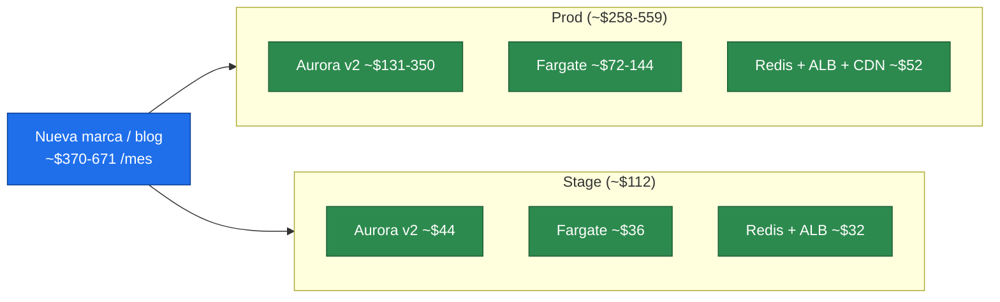

### 5.2.4 Palancas de optimización de costo

- **Aurora Serverless v2** ya optimiza: Stage y marcas de bajo tráfico caen al mínimo de ACU cuando están inactivas (la mayor parte del tiempo, según los datos de §5.1).
- **Compute Savings Plans** sobre Fargate: hasta ~20-30% de ahorro si se compromete uso base (2 tareas por marca son predecibles).
- **NAT:** consolidar o usar VPC endpoints (S3, ECR, Secrets) reduce el tráfico NAT y su costo.
- **Rango bajo (~$370/marca)** es el escenario esperable según el tráfico real medido (§5.1); el rango alto asume picos sostenidos de campaña que serán ocasionales.

> **Salvedad honesta:** estos números son de **infraestructura AWS**. El TCO real del proyecto incluye el **equipo WPMT dedicado** (el costo dominante, ver PRD §8) y las **licencias de plugins**. El deep research de riesgos advirtió que el equipo puede ser el mayor sumidero de costo; la infraestructura, como se ve aquí, es comparativamente modesta por el bajo tráfico.

---

## 6. Vista de datos — aislamiento por marca

Cada marca tiene su propia base de datos. Blast radius acotado: una brecha o falla en una marca no alcanza a las demás.

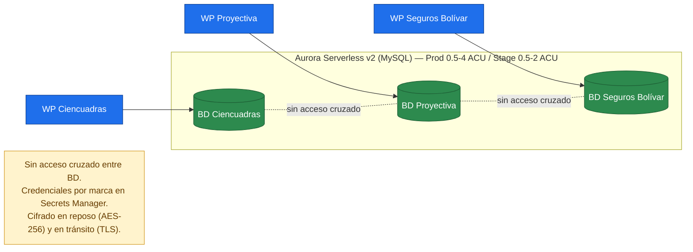

> Media (imágenes, PDF) vive en **S3 por marca** vía offload, fuera del ciclo de vida del contenedor. El contenedor es efímero y de solo lectura; el estado dinámico está desacoplado.

---

## 7. Proceso — Promoción de contenido (Stage → Prod)

Alcance: **páginas, posts y medios**. Menús y configuración quedan fuera (ver PRD §7.2). El usuario solo ve "revisar → aprobar → publicar"; el pipeline hace el trabajo pesado de forma asíncrona.

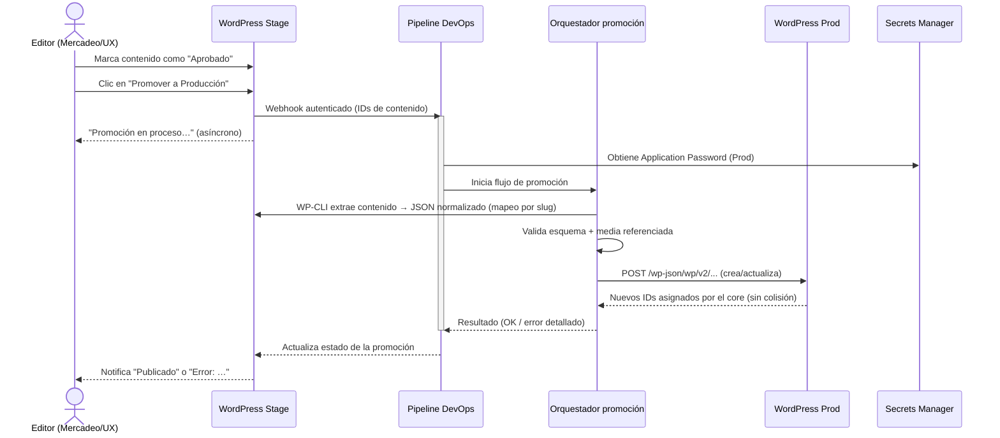

**Por qué así (del deep research):** el core de Prod reasigna IDs y evita colisiones; no se toca la BD directamente, evitando corrupción de datos serializados. La autenticación por Application Passwords da trazabilidad de quién promovió qué.

---

## 8. Proceso — Ciclo de vida de plugins y versiones (build inmutable)

Resuelve el dolor RF-03: la instalación de plugins deja de ser una acción manual en runtime y se vuelve un cambio versionado.

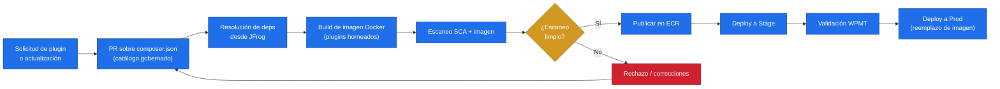

> Al reiniciar Fargate, la tarea arranca con los plugins ya presentes en la imagen. **Elimina el registro manual en S3.**
> Riesgo señalado en `deep-research-riesgos.md`: la ventana de explotación puede ser corta; por eso se complementa con **WAF (virtual patching)** en el perímetro y un canal fast-track de despliegue para parches críticos.

---

## 9. Proceso — Onboarding de una nueva marca

Alta repetible y parametrizada por IaC, para incorporar marcas por demanda con costo marginal decreciente.

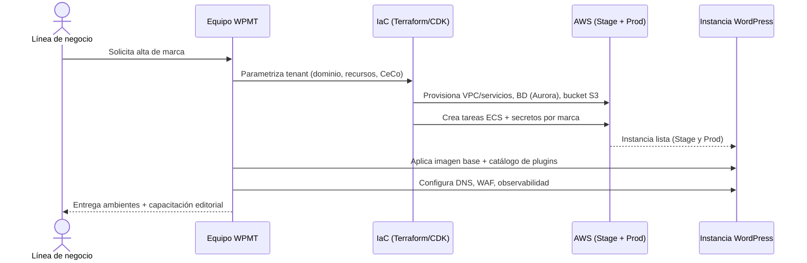

---

## 9.1 Proceso DevOps end-to-end

Vista del ciclo que opera el equipo de plataforma (DevOps/WPMT): desde un cambio (nuevo plugin, actualización de core, hotfix) hasta el despliegue por ambiente, con los caminos de **parche crítico (fast-track)** y **rollback** que el `deep-research-riesgos.md` señaló como indispensables ante la ventana de explotación corta.

### 9.1.1 Flujo por responsables (swimlanes)

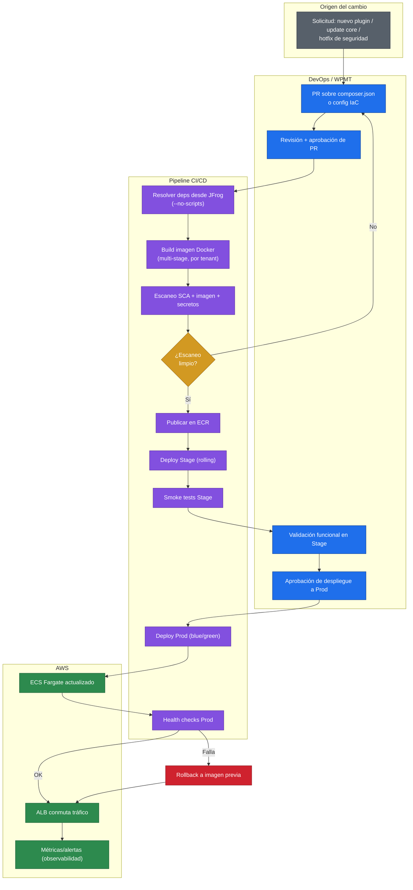

### 9.1.2 Camino de parche crítico (fast-track de seguridad)

Ante una vulnerabilidad negative-day, el proceso normal (build + escaneo + deploy a N marcas) no compite con la ventana de explotación (~5 h). El fast-track combina mitigación inmediata en el perímetro con el parche de fondo.

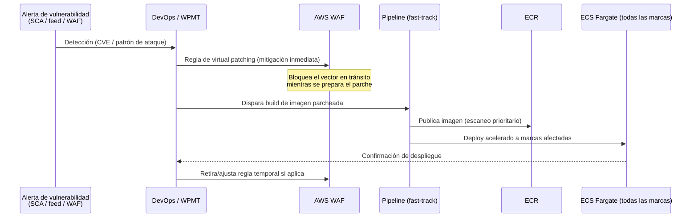

### 9.1.3 Máquina de estados de un despliegue

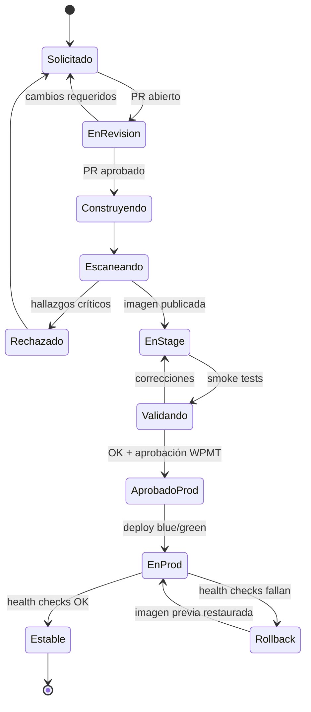

> **Notas de diseño DevOps:**
> - **Blue/green en Prod** para conmutar tráfico sin downtime y permitir rollback inmediato (revertir al target group anterior).
> - **`--no-scripts` en Composer** y **cooldown de 72 h** para paquetes nuevos (mitigación de cadena de suministro).
> - Todo cambio a Prod pasa por **aprobación humana** (gate), salvo el fast-track de seguridad que prioriza la mitigación en WAF.
> - Métricas y alertas con **correlation-id** por despliegue para trazabilidad.

---

## 9.2 Catálogo de plugins y fuentes confiables

Concreta la matriz de plugins del PRD §9. Distingue **transversales** (horneados en la imagen base, aplican a todas las marcas) de **por marca** (según el tema y las necesidades de la línea). Toda dependencia entra por el catálogo gobernado (`composer.json`) y se resuelve vía **JFrog Artifactory** (proxy + escaneo + cooldown 72h), nunca por instalación manual ni fuentes nulled.

### 9.2.1 Plugins transversales (todas las marcas)

Se hornean en la **imagen base** común. Cambios versionados por PR (ver §8).

| Concern | Plugin sugerido | Licenciamiento | Fuente confiable |
|---|---|---|---|
| Media offload a S3/CloudFront | **WP Offload Media** (Lite gratis / Pro por sitio) | Lite: GPL gratis · Pro: por licencia/sitio | deliciousbrains.com (oficial) / repo wordpress.org (Lite) |
| SEO | **Yoast SEO** o **Rank Math** | Free GPL · Premium por sitio | wordpress.org / yoast.com / rankmath.com (oficial) |
| Object cache (Redis) | **Redis Object Cache** | GPL gratis | wordpress.org (autor: Till Krüss, oficial) |
| Seguridad / hardening | **Wordfence** o **Sucuri** | Free GPL · Premium por sitio | wordpress.org / wordfence.com (oficial) |
| Promoción / API REST helper | Custom (WP-CLI + REST) del equipo WPMT | Interno | Repo corporativo |
| Backups | **UpdraftPlus** o nativo AWS (snapshots) | Free/Premium | updraftplus.com (oficial) |
| Multilenguaje (si aplica) | **WPML** o **Polylang** | WPML por sitio · Polylang free/Pro | wpml.org / polylang.pro (oficial) |
| Formularios (sin PII en BD) | **Gravity Forms** / **WPForms** + webhook al CRM | Por licencia/sitio | gravityforms.com / wpforms.com (oficial) |
| Caché de página | **WP Rocket** (o caché en CloudFront) | Por sitio | wp-rocket.me (oficial) |

> Nota: los **formularios** deben configurarse para enviar por **webhook al CRM** y no persistir PII en `wp_postmeta` (mitigación SFC 007 / Ley 1581, ver §10).

### 9.2.2 Plugins por marca (según tema y necesidad)

Se hornean en la **imagen derivada** de cada marca (multi-stage build), no en la base. Solo los binarios que la línea usa, para no inflar superficie de ataque.

| Categoría | Ejemplos | Licenciamiento | Fuente confiable |
|---|---|---|---|
| Page builder / tema | **Elementor Pro**, Divi, Beaver Builder | Suscripción anual por sitio/agency (Elementor Pro: single ~$59/año, agency hasta 1000 sitios ~$399/año) | elementor.com (oficial) · **NUNCA** "GPL nulled" de terceros |
| Widgets/addons del builder | Essential Addons, Crocoblock (JetPlugins) | Por licencia | crocoblock.com / oficial del addon |
| Custom fields | **ACF Pro** (Advanced Custom Fields) | Por licencia | advancedcustomfields.com (oficial) |
| E-commerce (si aplica) | **WooCommerce** + extensiones | Core GPL · extensiones por licencia | woocommerce.com (oficial) |
| Componentes de tema específicos | según la marca | variable | Solo autores verificados |

### 9.2.3 Fuentes confiables — política de procedencia

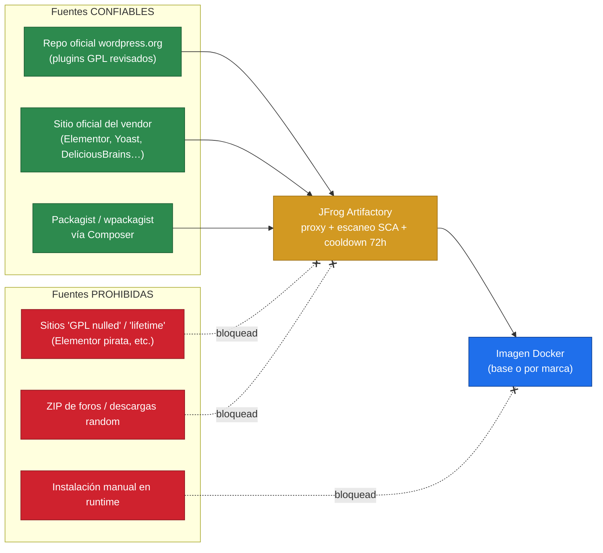

**Reglas de procedencia (no negociables):**
- **Solo** repositorio oficial de wordpress.org, sitio oficial del vendor, o Packagist/wpackagist — siempre **a través de JFrog** como proxy y caché.
- **Prohibido** cualquier sitio de "GPL nulled", "lifetime license" o redistribución no oficial: son vector nº1 de malware y typosquatting (el deep research documentó la cadena de suministro como riesgo crítico).
- **Prohibida** la instalación manual de plugins en runtime (rompe la inmutabilidad y deja el estado sin versionar).
- Todo paquete pasa **escaneo SCA** en el pipeline y **cooldown de 72h** para versiones nuevas antes de promoverse.
- Los plugins **licenciados** (Elementor Pro, ACF Pro, WPML, etc.) se gestionan con **claves de licencia por sitio en Secrets Manager**, nunca embebidas en código ni en la imagen pública.

### 9.2.4 Relación con CeCo

- **Transversales gratuitos (GPL):** costo cero, prorrateados solo por operación (equipo WPMT).
- **Transversales licenciados** (si los hay): licencia multimarca/agency → prorrateo entre marcas.
- **Por marca licenciados** (Elementor Pro, ACF Pro…): atribuidos directamente al CeCo de esa línea. Preferir **licencias agency/ilimitadas** cuando varias marcas usan el mismo plugin, para no multiplicar el costo (advertencia de "explosión de licencias" del deep research).

---

## 10. Blueprint de seguridad (defensa en profundidad)

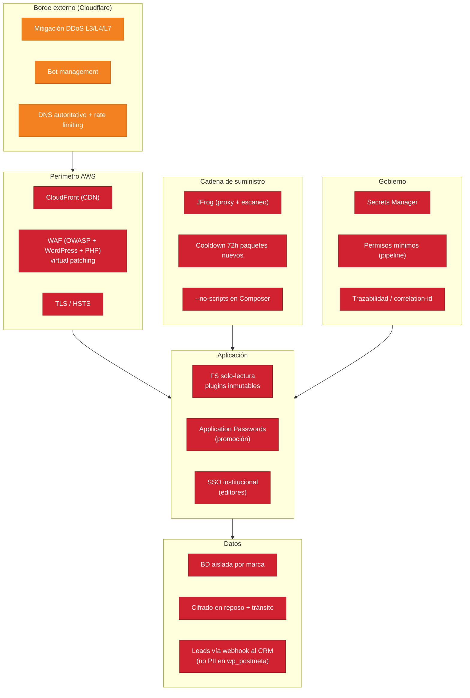

Cada capa mitiga riesgos concretos identificados en `deep-research-riesgos.md`: DDoS y bots (L0, Cloudflare), exfiltración de PII (L3), negative-day (L1), cadena de suministro (L4), aislamiento multitenant (L3), fuga de secretos (L5). Cloudflare (L0) actúa como primer filtro antes de que el tráfico alcance CloudFront/WAF, absorbiendo volumetría y tráfico automatizado en el borde.

---

## 11. Vista de red y tráfico (petición pública)

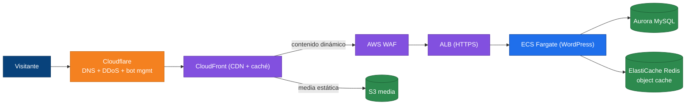

> **Cloudflare** es el primer salto: resuelve DNS, absorbe DDoS y filtra bots antes de reenviar a **CloudFront**, donde AWS WAF aplica las reglas de WordPress/PHP. **ElastiCache (Redis)** como object cache saca la presión de `wp_options`/transients de la BD, mitigando la degradación de rendimiento señalada en el deep research.
>
> **Nota de configuración (a cerrar en diseño):** para que la protección en dos capas sea efectiva y no se pueda saltar Cloudflare, conviene **restringir el origen** — que CloudFront solo acepte tráfico proveniente de Cloudflare (p. ej. validación de header secreto/mTLS y listas de IP de Cloudflare en WAF). Se añade como decisión D8 en §16.

---

## 12. Service blueprint (negocio)

Separa lo que ve el usuario (front-stage) de lo que ocurre por detrás (back-stage). Aclara la promesa de servicio.

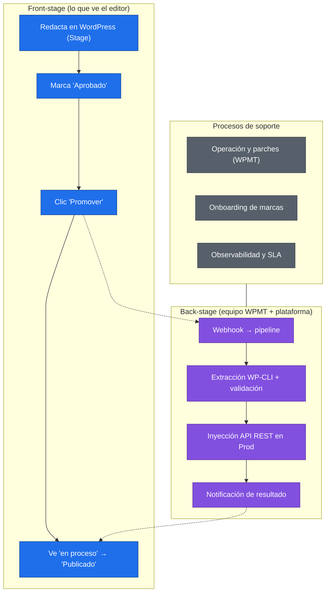

---

## 13. Modelo operativo y responsabilidades (RACI)

> **Recomendación de arquitectura:** la plataforma se opera con un **equipo dedicado WPMT** (soporte, actualización de core/plugins, mantenimiento, seguridad y onboarding). Es condición de éxito de la iniciativa, no un detalle organizacional — ver la justificación completa en el PRD §8. Toda la arquitectura de este documento (imágenes inmutables, pipeline de promoción, fast-track de seguridad, onboarding por IaC) asume ese dueño técnico permanente.

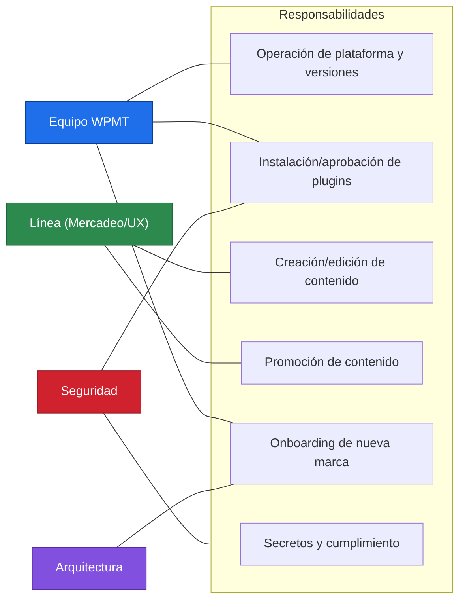

> El detalle de la matriz RACI (R/A/C/I por actividad) está en el PRD §8.2. Aquí se muestra la asignación principal.

---

## 14. Roadmap por olas

```mermaid
flowchart LR
    subgraph O0["Ola 0 — Fundación"]
        a1["PoC promoción<br/>(páginas/posts/medios)"]
        a2["Excepción de stack formalizada"]
        a3["Equipo WPMT + IaC base"]
    end
    subgraph O1["Ola 1 — Primeras marcas"]
        b1["Onboarding Ciencuadras"]
        b2["Onboarding Proyectiva"]
        b3["Estabilización"]
    end
    subgraph O2["Ola 2 — Marca estable"]
        c1["Onboarding Seguros Bolívar"]
    end
    subgraph O3["Ola 3+ — Escala"]
        d1["Marcas por demanda"]
        d2["Evaluar Headless-ready"]
    end

    O0 --> O1 --> O2 --> O3

    classDef o fill:#1f6feb,color:#fff,stroke:#0b3d91;
```

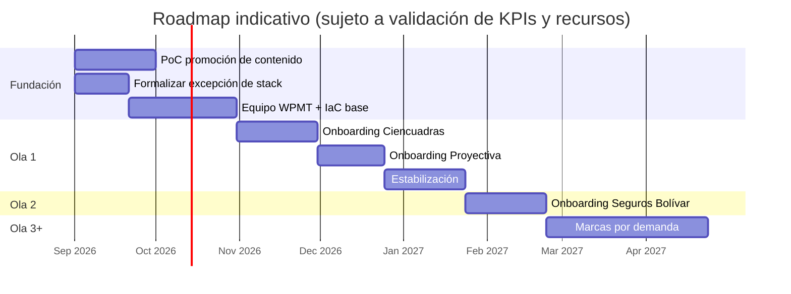

> Las fechas son **indicativas**; dependen de la validación de KPIs/SLO (PRD Q7) y del dimensionamiento del equipo (PRD Q9).

---

## 15. Decisiones de arquitectura → riesgos mitigados

Trazabilidad entre cada decisión y el riesgo del deep research que atiende.

```mermaid
flowchart LR
    d1["Multi-instancia aislada<br/>+ BD por marca"]:::d --> r1["Blast radius / aislamiento (R6)"]:::r
    d2["MySQL / Aurora Serverless v2"]:::d --> r2["Falacia PostgreSQL / corrupción"]:::r
    d3["Plugins horneados en imagen"]:::d --> r3["Registro manual de plugins (RF-03)"]:::r
    d4["Promoción por API REST + WP-CLI<br/>(páginas/posts/medios)"]:::d --> r4["Colisión de IDs / serialización (R1)"]:::r
    d5["Leads vía webhook al CRM"]:::d --> r5["PII en texto plano / SFC 007 (R6)"]:::r
    d6["WAF + virtual patching"]:::d --> r6["Negative-day (R2/seguridad)"]:::r
    d10["Cloudflare delante de CloudFront"]:::d --> r10["DDoS / bots / volumetría en el borde"]:::r
    d7["JFrog + cooldown + no-scripts"]:::d --> r7["Cadena de suministro"]:::r
    d8["Equipo WPMT + fast-track"]:::d --> r8["Cuello de botella operativo (R5)"]:::r
    d9["Redis object cache"]:::d --> r9["Degradación por wp_options"]:::r

    classDef d fill:#1f6feb,color:#fff,stroke:#0b3d91;
    classDef r fill:#cf222e,color:#fff,stroke:#8b1a22;
```

---

## 16. Decisiones de diseño abiertas (para cerrar antes de construcción)

| # | Decisión | Estado |
|---|---|---|
| D1 | Aurora Serverless v2 vs RDS MySQL (dimensionamiento/costo) | Recomendado Serverless v2 (0.5–4 ACU Prod) según datos reales §5.1; confirmar en diseño |
| D2 | ¿EFS acotado para cachés de plugins que exigen escritura, o solo imagen inmutable? | Cerrar en PoC |
| D3 | Plugin/estados editoriales exactos para el botón de aprobación (Opción A) | Abierta |
| D4 | Herramienta de pipeline definitiva y su patrón de webhook seguro | Abierta |
| D5 | SSO institucional para editores | PRD Q5 |
| D6 | Estrategia de object cache (Redis gestionado ElastiCache) por marca vs compartido | Abierta |
| D7 | KPIs/SLO por servicio | PRD Q7 |
| D8 | Restricción de origen CloudFront ↔ Cloudflare (header secreto/mTLS + IPs de Cloudflare en WAF) para impedir bypass del borde | Abierta |

---

## 17. Glosario

Siglas y términos usados en este documento y en el PRD.

### Licenciamiento

| Término | Significado | Nota en este contexto |
|---|---|---|
| **GPL** | *General Public License* (Licencia Pública General de GNU). Licencia de software libre bajo la que se distribuye WordPress y la mayoría de sus plugins/temas. Permite usar, modificar y redistribuir libremente, incluso comercialmente. | Ser GPL **no implica ser gratis**: muchos plugins "Pro" son GPL pero su soporte/actualizaciones requieren licencia de pago. |
| **GPL "nulled"** | Redistribución no oficial de un plugin/tema Pro (a menudo anunciada como "GPL" o "lifetime"). | **Prohibido** (§9.2.3): vector frecuente de malware y typosquatting, aunque la GPL lo permita legalmente. |
| **ELA** | *Enterprise License Agreement*. Acuerdo de licencia empresarial que cubre uso multimarca/multisitio. | Recomendado para plugins usados por varias marcas, para evitar la "explosión de licencias". |
| **CeCo** | Centro de Costos. Unidad contable a la que se atribuye un gasto. | Se usa para repartir el costo de la plataforma entre líneas de negocio. |

### Cómputo, datos y red (AWS)

| Término | Significado |
|---|---|
| **ECS** | *Elastic Container Service*. Orquestador de contenedores de AWS. |
| **Fargate** | Modo "serverless" de ECS: ejecuta contenedores sin administrar servidores/EC2. |
| **vCPU** | CPU virtual. Unidad de cómputo asignada a una tarea (p. ej. 1 vCPU / 2 GB). |
| **Aurora Serverless v2** | Base de datos relacional gestionada de AWS (compatible con MySQL) que escala automáticamente su capacidad. |
| **ACU** | *Aurora Capacity Unit*. Unidad de capacidad de Aurora Serverless v2 (memoria + CPU); escala en incrementos de 0.5. |
| **RDS** | *Relational Database Service*. Servicio gestionado de bases de datos de AWS. |
| **Multi-AZ** | Despliegue en múltiples *Availability Zones* (zonas de disponibilidad) para alta disponibilidad. |
| **S3** | *Simple Storage Service*. Almacenamiento de objetos de AWS (aquí, para media). |
| **CloudFront** | CDN (red de distribución de contenido) de AWS. |
| **ALB / NLB** | *Application / Network Load Balancer*. Balanceadores de carga de AWS. |
| **NAT Gateway** | Componente que permite a recursos en subredes privadas salir a internet sin ser accesibles desde fuera. |
| **VPC** | *Virtual Private Cloud*. Red privada virtual aislada dentro de AWS. |
| **ECR** | *Elastic Container Registry*. Registro de imágenes Docker de AWS. |
| **ElastiCache / Redis** | Servicio de caché en memoria gestionado; Redis se usa como *object cache* de WordPress. |
| **Secrets Manager** | Servicio de AWS para almacenar credenciales/secretos de forma segura. |
| **CDN** | *Content Delivery Network*. Red de servidores que sirve contenido cerca del usuario. |
| **RPS** | *Requests Per Second*. Peticiones por segundo (métrica de tráfico). |
| **LCU** | *Load Balancer Capacity Unit*. Unidad de facturación de los balanceadores. |

### Seguridad

| Término | Significado |
|---|---|
| **WAF** | *Web Application Firewall*. Filtra tráfico web malicioso (OWASP Top 10, ataques a WordPress/PHP). |
| **DDoS** | *Distributed Denial of Service*. Ataque de denegación de servicio distribuido (mitigado por Cloudflare, §10). |
| **Cloudflare** | Proveedor de seguridad/CDN externo, aquí como primera capa perimetral (DNS, DDoS, bots) delante de CloudFront. |
| **SCA** | *Software Composition Analysis*. Escaneo de dependencias en busca de vulnerabilidades. |
| **Virtual patching** | Mitigar una vulnerabilidad con una regla en el WAF sin modificar el código, mientras se prepara el parche real. |
| **Negative-day** | Vulnerabilidad publicada **sin** parche disponible del desarrollador al momento de su divulgación. |
| **PII** | *Personally Identifiable Information*. Datos personales (nombre, correo, teléfono…). |
| **IdP / SSO** | *Identity Provider* / *Single Sign-On*. Proveedor de identidad y inicio de sesión único institucional. |
| **mTLS** | *Mutual TLS*. Autenticación mutua por certificados entre cliente y servidor. |
| **TLS / HSTS** | *Transport Layer Security* (cifrado en tránsito) / *HTTP Strict Transport Security* (fuerza HTTPS). |
| **BOLA / IDOR** | Fallos de autorización a nivel de objeto (acceder a recursos de otro usuario manipulando IDs). |
| **OWASP** | *Open Worldwide Application Security Project*. Referencia de riesgos de seguridad web (el "Top 10"). |
| **Habeas Data / Ley 1581 / SFC 007** | Marco colombiano de protección de datos personales (Ley 1581 de 2012) y ciberseguridad del sector financiero (Circular Externa 007 de la Superintendencia Financiera de Colombia). |

### WordPress / desarrollo

| Término | Significado |
|---|---|
| **CMS** | *Content Management System*. Sistema de gestión de contenidos (WordPress lo es). |
| **WP-CLI** | Interfaz de línea de comandos de WordPress; permite operar el CMS por scripts. |
| **API REST** | Interfaz HTTP de WordPress (`/wp-json/...`) para crear/leer contenido de forma programática. |
| **Gutenberg** | Editor de bloques nativo de WordPress; guarda el contenido como bloques (JSON en comentarios HTML). |
| **Application Passwords** | Tokens de WordPress dedicados a integraciones/API, revocables y auditables, separados de la contraseña del usuario. |
| **Headless / desacoplado** | Arquitectura donde WordPress solo provee datos (API) y el front-end se construye aparte (p. ej. Next.js). |
| **Multitenant / tenant** | Plataforma que aloja múltiples inquilinos (aquí, marcas) aislados entre sí. |
| **Multisite** | Función nativa de WordPress para varios sitios sobre una sola instalación/BD (descartada por aislamiento débil). |
| **Media offload** | Mover los archivos subidos (imágenes, PDF) a almacenamiento externo (S3) en vez del disco del contenedor. |
| **Imagen inmutable / horneada** | Imagen Docker que ya incluye el código y plugins; no se modifica en ejecución. |
| **Serialización (PHP)** | Formato en que WordPress guarda arreglos/objetos en la BD; codifica la longitud exacta, por eso el search-replace ingenuo la corrompe. |
| **Page builder** | Constructor visual de páginas (Elementor, Divi…) que se integra al tema de WordPress. |
| **Composer / Packagist / wpackagist** | Gestor de dependencias de PHP / su repositorio público / índice de plugins WP para Composer. |

### Arquitectura y proceso

| Término | Significado |
|---|---|
| **C4** | Modelo de diagramas de arquitectura por niveles: Contexto, Contenedores, Componentes, Código. |
| **IaC** | *Infrastructure as Code*. Infraestructura definida en código (Terraform, AWS CDK). |
| **CI/CD** | *Continuous Integration / Continuous Delivery*. Integración y entrega continuas (pipelines). |
| **Blue/green** | Estrategia de despliegue con dos entornos para conmutar tráfico sin downtime y revertir rápido. |
| **Rolling** | Despliegue gradual que reemplaza tareas de a pocas para no interrumpir el servicio. |
| **Rollback** | Revertir a la versión anterior tras un despliegue fallido. |
| **Fast-track** | Vía acelerada de despliegue para parches críticos de seguridad. |
| **Smoke test / health check** | Pruebas rápidas para verificar que un despliegue quedó funcional/sano. |
| **RACI** | Matriz de responsabilidades: *Responsible, Accountable, Consulted, Informed*. |
| **SLO / SLA** | *Service Level Objective / Agreement*. Objetivo/acuerdo de nivel de servicio (disponibilidad, latencia). |
| **TCO** | *Total Cost of Ownership*. Costo total de propiedad (infra + equipo + licencias + operación). |
| **MVP** | *Minimum Viable Product*. Producto mínimo viable (primer alcance entregable). |
| **PoC** | *Proof of Concept*. Prueba de concepto. |
| **PRD** | *Product Requirements Document*. Documento de requisitos de producto. |
| **AI-DLC** | *AI-Driven Development Life Cycle*. Framework de AWS que consume el PRD como insumo. |
| **WPMT** | *WordPress Multitenant* (nombre de esta plataforma) / equipo dedicado que la opera. |
| **EA** | *Enterprise Architecture*. Arquitectura Empresarial. |

---

*Documento de diseño en borrador. Los diagramas Mermaid se renderizan en GitHub/VS Code. Las decisiones D1-D8 deben cerrarse antes de pasar a construcción (tasks.md).*
